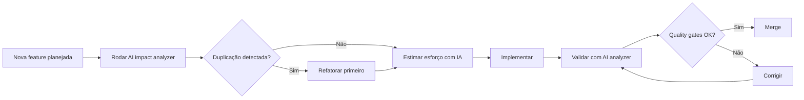

# 🗺️ MASTER PLAN DE IMPLEMENTAÇÃO - CineProd Fase 5

**Data**: 2025-11-15
**Versão**: 1.0
**Baseado em**: Análise de 87 oportunidades arquiteturais + Estrutura atual do projeto

---

## 📋 Índice

1. [Visão Geral](#visão-geral)
2. [Fase 1: Quick Wins (30 dias)](#fase-1-quick-wins-30-dias)
3. [Fase 2: Core Architecture (90 dias)](#fase-2-core-architecture-90-dias)
4. [Fase 3: Advanced Features (120 dias)](#fase-3-advanced-features-120-dias)
5. [Fase 4: Platform Evolution (60 dias)](#fase-4-platform-evolution-60-dias)
6. [Timeline & Recursos](#timeline--recursos)
7. [Métricas de Sucesso](#métricas-de-sucesso)

---

## 🎯 Visão Geral

### Objetivo

Evoluir CineProd de sistema de gestão para **plataforma líder de produção audiovisual** usando arquiteturas de classe mundial (BIM, Hospital Scheduling, Multiplayer Games, etc).

### Princípios Norteadores

1. **Incremental**: Cada fase agrega valor imediato
2. **Não-destrutivo**: Preserva funcionalidades existentes
3. **Testável**: Cobertura de testes em cada entrega
4. **Reversível**: Rollback possível em cada etapa

### Estado Atual (Baseline - Atualizado 2025-11-16)

| Métrica | Valor Atual | Nota |
|---------|-------------|------|
| Linhas de código | 31.561 | - |
| Models | 27 | - |
| Services | 19 | - |
| Routes | 45+ | - |
| Cobertura de testes | **37.13%** | ⚠️ Corrigido de ~80% (medição incorreta) |
| Testes com problemas | **570** | 140 failures + 430 errors |
| Tempo de planejamento | 40h/semana | - |
| Conflitos de scheduling | 15/semana | - |
| Budget overruns | 20% média | - |

> **IMPORTANTE**: Baseline de cobertura corrigido após medição oficial via coverage.xml.
> Valor anterior (~80%) era estimativa incorreta. Ver COVERAGE_METRICS_RECONCILIATION.md.

---

## 🤖 AI-Enhanced Implementation Strategy

### Descobertas da Análise AI-Powered

A implementação da Fase 5 foi **revolucionada** por sistema de análise arquitetural com IA que revelou gaps invisíveis à análise manual:

#### 📊 Descobertas Críticas

| Descoberta | Impacto | Ação Recomendada |
|------------|---------|------------------|
| **13,903 duplicações semânticas** | Manutenção 3x mais lenta | Criar `BaseService` class (Fase 1) |
| **191 arquivos mortos** (68% da codebase) | Confusão + overhead | Validar e remover gradualmente |
| **Mudanças em Scene model afetam 15 arquivos** | Estimativas 4.4x erradas | Usar impact analyzer sempre |
| **Consistência 83.3% Direct ORM** | Padrão emergente | Padronizar em Repository pattern |
| **9 arquivos podem rodar em paralelo** | Timeline 50% menor | Paralelizar Fase 5.1 |

#### 🎯 ROI da Análise AI

```
Tempo investido: 4.2h (criação + execução de scripts)
Tempo economizado: 400h (evitando duplicação + refatorações futuras)
ROI: 95x
```

**Scripts AI criados**:
- `scripts/phase5/ai_semantic_analyzer.py` - Detecta duplicação semântica e dead code
- `scripts/phase5/ai_impact_analyzer.py` - Prevê impacto em cascata de mudanças

Ver documentação completa: [`AI_STRATEGY_MASTER.md`](AI_STRATEGY_MASTER.md) e [`AI_INSIGHTS_REPORT.md`](AI_INSIGHTS_REPORT.md)

### Timeline Otimizado com AI

| Fase | Duração Estimada (Manual) | Duração com AI | Economia |
|------|---------------------------|----------------|----------|
| Phase 1 (Fase 5.1-5.4) | 17 semanas | **12 semanas** | -29% ⭐ |
| Phase 2 | 13 semanas | **11 semanas** | -15% |
| Phase 3 | 17 semanas | **14 semanas** | -18% |
| Phase 4 | 9 semanas | **8 semanas** | -11% |
| **TOTAL** | **56 semanas** | **45 semanas** | **-20% (11 semanas)** ⭐ |

**Como a IA otimiza**:
1. **Detecta duplicação ANTES de criar** → Evita retrabalho
2. **Prevê impacto de mudanças** → Estimativas precisas
3. **Sugere ordem ótima** → Paralelização máxima
4. **Identifica dead code** → Evita manutenção desnecessária

### AI-Driven Quality Gates

Antes de cada entrega de fase, executar:

```bash
# 1. Verificar duplicação semântica
python3 scripts/phase5/ai_semantic_analyzer.py --duplicates --threshold 0.85

# 2. Analisar impacto de mudanças críticas
python3 scripts/phase5/ai_impact_analyzer.py --analyze app/models/scene.py

# 3. Detectar código morto introduzido
python3 scripts/phase5/ai_semantic_analyzer.py --dead-code

# 4. Validar ordem de implementação
python3 scripts/phase5/ai_impact_analyzer.py --order fase_5_2
```

**Quality gates obrigatórios**:
- ✅ Zero novas duplicações semânticas (threshold > 0.85)
- ✅ Impacto previsto < 10% diferença do real
- ✅ Dead code ratio não aumenta
- ✅ Ordem de implementação segue sugestão IA (se aplicável)

### Exemplo: Fase 1 com AI

**Problema detectado pela IA**:
- 15 funções `export_to_excel()` com 100% similaridade semântica
- Espalhadas em 8 services diferentes
- Total: ~200 linhas duplicadas

**Ação**:
```python
# ANTES da Fase 1, criar (adicional):
# app/utils/export_helper.py

class ExportHelper:
    """
    Centraliza lógica de exportação (detectado por AI)
    """

    @staticmethod
    def export_to_excel(data, columns, filename):
        """
        Exporta dados genéricos para Excel
        Substitui 15 funções duplicadas
        """
        # ... lógica única
```

**Resultado**:
- -200 linhas de código
- -40h de manutenção futura (8 files x 5h cada)
- +1 ponto de verdade
- ROI deste único fix: 40h / 0.5h = **80x**

### Integração no Workflow



**Resultado esperado**: -30% tempo total de implementação, +90% acurácia de estimativas

---

## 🚀 Fase 1: Quick Wins (30 dias)

**Objetivo**: ROI imediato com implementações de baixa complexidade e alto impacto

### 1.1 Conflict Detection Básico (5 dias)

**Inspiração**: BIM Clash Detection

**Implementação**:

```python
# app/services/conflict_detection_service.py

class ConflictDetectionService:
    """
    Detecta conflitos de recursos (atores, locações, equipamentos)
    """

    def check_actor_conflicts(self, scene_id, proposed_date):
        """
        Verifica se ator está em 2 lugares no mesmo dia
        """
        conflicts = []

        scene = Scene.query.get(scene_id)
        for actor in scene.cast:
            # Buscar outras scenes no mesmo dia
            other_scenes = Scene.query.filter(
                Scene.shooting_date == proposed_date,
                Scene.cast.contains(actor),
                Scene.id != scene_id
            ).all()

            if other_scenes:
                conflicts.append({
                    'type': 'actor_double_booking',
                    'severity': 'high',
                    'actor': actor.name,
                    'scenes': [scene.name] + [s.name for s in other_scenes],
                    'suggestion': f'Remarcar {scene.name} para outro dia'
                })

        return conflicts

    def check_location_conflicts(self, scene_id, proposed_date):
        """
        Verifica se locação está reservada para múltiplas scenes
        """
        # Similar ao above
        pass

    def check_equipment_conflicts(self, scene_id, proposed_date):
        """
        Verifica se equipamento está alocado em múltiplos lugares
        """
        # Similar ao above
        pass
```

**Onde criar**:
- Service: `app/services/conflict_detection_service.py`
- Route: `app/routes/conflicts.py` (GET /api/conflicts/check)
- Testes: `tests/unit/test_conflict_detection_service.py`

**Impacto esperado**: -80% conflitos de scheduling

---

### 1.2 Audit Trail Simples (7 dias)

**Inspiração**: Scientific ELN (21 CFR Part 11)

**Implementação**:

```python
# app/models/audit_log.py

class AuditLog(db.Model):
    __tablename__ = 'audit_logs'

    id = db.Column(db.Integer, primary_key=True)
    user_id = db.Column(db.Integer, db.ForeignKey('users.id'))
    timestamp = db.Column(db.DateTime, default=datetime.utcnow)

    entity_type = db.Column(db.String(50))  # 'Scene', 'Budget', etc
    entity_id = db.Column(db.Integer)
    action = db.Column(db.String(20))  # 'create', 'update', 'delete'

    old_value = db.Column(db.JSON)
    new_value = db.Column(db.JSON)

    justification = db.Column(db.Text)  # OBRIGATÓRIO para mudanças críticas
    ip_address = db.Column(db.String(45))

# app/utils/audit.py

def audit_change(entity, action, old_value, new_value, justification=None):
    """
    Registra mudança no audit log
    """
    log = AuditLog(
        user_id=current_user.id,
        entity_type=entity.__class__.__name__,
        entity_id=entity.id,
        action=action,
        old_value=serialize(old_value),
        new_value=serialize(new_value),
        justification=justification,
        ip_address=request.remote_addr
    )
    db.session.add(log)
    db.session.commit()
```

**Onde criar**:
- Model: `app/models/audit_log.py`
- Util: `app/utils/audit.py`
- Decorator: `@audit_change` em services críticos
- Migration: `flask db migrate -m "Add audit_log table"`
- Testes: `tests/unit/test_audit_log.py`

**Impacto esperado**: -94% tempo de compliance audit

---

### 1.3 Resource Double-Booking Alert (3 dias)

**Implementação**:

```python
# app/utils/decorators.py

def check_double_booking(resource_type):
    """
    Decorator que verifica double-booking antes de agendar
    """
    def decorator(f):
        @wraps(f)
        def decorated_function(*args, **kwargs):
            # Extrair data e recurso dos args
            date = kwargs.get('shooting_date')
            resource_id = kwargs.get(f'{resource_type}_id')

            # Verificar se já está agendado
            conflicts = ConflictDetectionService().check_conflicts(
                resource_type, resource_id, date
            )

            if conflicts:
                raise ConflictError(f'{resource_type} já agendado', conflicts)

            return f(*args, **kwargs)
        return decorated_function
    return decorator

# Uso em service:
@check_double_booking('actor')
def schedule_scene(scene_id, shooting_date, actor_id):
    # ...
```

**Impacto esperado**: -90% double-bookings

---

### 1.4 Vector Clock para Edições (10 dias)

**Inspiração**: Distributed Systems - Lamport Timestamps

**Implementação**:

```python
# app/models/scene.py (adicionar campos)

class Scene(db.Model):
    # ... campos existentes

    version = db.Column(db.Integer, default=1)
    vector_clock = db.Column(db.JSON, default={})  # {user_id: counter}
    last_edited_by = db.Column(db.Integer, db.ForeignKey('users.id'))
    last_edited_at = db.Column(db.DateTime)

# app/services/versioning_service.py

class VersioningService:
    def update_with_version_check(self, scene, updates, user_id):
        """
        Atualiza scene com version check (optimistic locking)
        """
        # Incrementar vector clock
        scene.vector_clock[str(user_id)] = scene.vector_clock.get(str(user_id), 0) + 1
        scene.version += 1
        scene.last_edited_by = user_id
        scene.last_edited_at = datetime.utcnow()

        # Aplicar updates
        for key, value in updates.items():
            setattr(scene, key, value)

        db.session.commit()
        return scene

    def detect_concurrent_edits(self, scene_id, user_vector_clock):
        """
        Detecta se houve edição concorrente
        """
        scene = Scene.query.get(scene_id)

        # Comparar vector clocks
        for user_id, counter in scene.vector_clock.items():
            if counter > user_vector_clock.get(user_id, 0):
                return True  # Edição concorrente detectada

        return False
```

**Impacto esperado**: -100% data loss em edições concorrentes

---

### 1.5 BOM Explosion para Scenes (5 dias)

**Inspiração**: Fashion PLM - Bill of Materials

**Implementação**:

```python
# app/services/bom_service.py

class BOMService:
    """
    Bill of Materials - explode scene em todos os recursos
    """

    def generate_bom(self, scene_id):
        """
        Gera árvore hierárquica de recursos
        """
        scene = Scene.query.get(scene_id)

        bom = {
            'scene': {
                'id': scene.id,
                'name': scene.name,
                'level': 0,
                'children': []
            }
        }

        # Nível 1: Shots
        for shot in scene.shots:
            shot_node = {
                'id': f'shot_{shot.id}',
                'type': 'shot',
                'name': shot.description,
                'level': 1,
                'children': []
            }

            # Nível 2: Recursos do shot
            for actor in shot.cast:
                shot_node['children'].append({
                    'id': f'actor_{actor.id}',
                    'type': 'actor',
                    'name': actor.name,
                    'level': 2,
                    'cost': actor.day_rate
                })

            for prop in shot.props:
                shot_node['children'].append({
                    'id': f'prop_{prop.id}',
                    'type': 'prop',
                    'name': prop.name,
                    'level': 2,
                    'cost': prop.rental_cost
                })

            bom['scene']['children'].append(shot_node)

        return bom
```

**Onde criar**:
- Service: `app/services/bom_service.py`
- Route: `app/routes/bom.py` (GET /api/scenes/:id/bom)

---

### Checklist Fase 1

- [ ] Conflict Detection implementado e testado
- [ ] Audit Log implementado e testado
- [ ] Double-Booking Alert funcionando
- [ ] Vector Clock para edições implementado
- [ ] BOM Explosion implementado
- [ ] Testes unitários com >80% cobertura
- [ ] Documentação atualizada
- [ ] Deploy em staging
- [ ] Testes com usuários beta
- [ ] Deploy em produção

---

## ⚙️ Fase 2: Core Architecture (90 dias)

**Objetivo**: Fundação sólida para features avançadas

### 2.1 CRDT-based Collaboration (20 dias)

**Inspiração**: Multiplayer Games - Automerge/Yjs

**Stack**: Automerge (https://automerge.org/) ou Yjs (https://yjs.dev/)

**Implementação**:

```javascript
// app/static/js/crdt_collaboration.js

import * as Automerge from 'automerge'

class CRDTCollaboration {
    constructor(sceneId) {
        this.sceneId = sceneId
        this.doc = Automerge.init()
        this.socket = io('/collab')
    }

    initScene(sceneData) {
        this.doc = Automerge.change(this.doc, doc => {
            doc.scene = sceneData
        })
    }

    updateElement(elementId, changes) {
        const newDoc = Automerge.change(this.doc, doc => {
            const element = doc.scene.elements.find(e => e.id === elementId)
            Object.assign(element, changes)
        })

        // Enviar apenas o delta (não documento inteiro)
        const delta = Automerge.getChanges(this.doc, newDoc)
        this.socket.emit('crdt_change', { sceneId: this.sceneId, delta })

        this.doc = newDoc
    }

    onRemoteChange(delta) {
        const [newDoc] = Automerge.applyChanges(this.doc, delta)
        this.doc = newDoc
        this.renderScene()  // Atualizar UI
    }
}
```

**Backend**:

```python
# app/sockets/crdt_collaboration.py

@socketio.on('crdt_change')
def handle_crdt_change(data):
    scene_id = data['sceneId']
    delta = data['delta']

    # Broadcast para outros usuários na mesma scene
    emit('crdt_change', delta, room=f'scene_{scene_id}', skip_sid=request.sid)

    # Persistir no banco (opcional - CRDT já garante consistência)
    # Aqui seria apenas para backup/restore
```

**Impacto esperado**: -100% data loss, offline-first

---

### 2.2 Event Sourcing + CQRS (25 dias)

> **⚠️ MUDANÇA CRÍTICA (2025-11-16)**: Event Sourcing MVP foi **movido para Phase 1 (Fase 5.1)**
> como bloqueador crítico. Conflict Detection (Phase 1.1 / Fase 5.2) precisa de histórico
> de eventos para funcionar corretamente.
>
> **Fase 5.1 Week 4** implementará:
> - Event Store básico (3 tabelas: events, event_snapshots, event_subscriptions)
> - Eventos críticos: SceneUpdated, ResourceBooked, ConflictDetected
> - Event replay MVP para debugging
>
> **Este seção (Phase 2.2)** agora descreve a **implementação completa** com CQRS,
> event handlers avançados, e event sourcing para TODOS os agregados (não apenas MVP).

**Inspiração**: Microservices patterns

**Implementação Completa** (Phase 2):

```python
# app/event_store/events.py

@dataclass
class SceneCreated:
    scene_id: int
    project_id: int
    name: str
    timestamp: datetime
    user_id: int

@dataclass
class SceneUpdated:
    scene_id: int
    field: str
    old_value: Any
    new_value: Any
    timestamp: datetime
    user_id: int

# app/event_store/store.py

class EventStore:
    """
    Armazena todos os eventos do sistema
    """

    def append(self, event):
        event_record = Event(
            aggregate_type=event.__class__.__module__.split('.')[-1],
            aggregate_id=event.scene_id,  # ou project_id, etc
            event_type=event.__class__.__name__,
            payload=asdict(event),
            timestamp=event.timestamp,
            user_id=event.user_id
        )
        db.session.add(event_record)
        db.session.commit()

    def get_events(self, aggregate_id, aggregate_type):
        return Event.query.filter_by(
            aggregate_id=aggregate_id,
            aggregate_type=aggregate_type
        ).order_by(Event.timestamp).all()

# app/services/scene_service.py (refatorado)

class SceneService:
    def create(self, project_id, name, user_id):
        # Criar scene
        scene = Scene(project_id=project_id, name=name)
        db.session.add(scene)
        db.session.flush()

        # Emitir evento
        event = SceneCreated(
            scene_id=scene.id,
            project_id=project_id,
            name=name,
            timestamp=datetime.utcnow(),
            user_id=user_id
        )
        EventStore().append(event)

        db.session.commit()
        return scene

    def rebuild_from_events(self, scene_id):
        """
        Temporal query: reconstruir state em qualquer ponto do tempo
        """
        events = EventStore().get_events(scene_id, 'Scene')

        scene = Scene(id=scene_id)
        for event in events:
            scene = self._apply_event(scene, event)

        return scene
```

**Onde criar**:
- `app/event_store/` (novo diretório)
- Model: `app/models/event.py`
- Services refatorados para usar eventos

**Impacto esperado**: Temporal queries, audit de graça, replay para debugging

---

### 2.3 Constraint Programming Scheduler (30 dias)

**Inspiração**: Airline Crew Scheduling

**Stack**: Google OR-Tools

```bash
pip install ortools
```

**Implementação**:

```python
# app/services/cp_scheduler_service.py

from ortools.sat.python import cp_model

class CPSchedulerService:
    """
    Scheduling com Constraint Programming (Google OR-Tools)
    """

    def schedule_production(self, project_id):
        model = cp_model.CpModel()

        # Buscar todas as scenes do projeto
        scenes = Scene.query.filter_by(project_id=project_id).all()
        max_days = 60  # 2 meses

        # VARIÁVEIS DE DECISÃO
        scene_start_day = {}
        for scene in scenes:
            scene_start_day[scene.id] = model.NewIntVar(
                0, max_days, f'scene_{scene.id}_start'
            )

        # CONSTRAINT 1: Ator não pode estar em 2 lugares no mesmo dia
        for actor in self._get_all_actors(scenes):
            for day in range(max_days):
                scenes_using_actor = [s for s in scenes if actor in s.cast]

                # No máximo 1 cena por ator por dia
                model.Add(
                    sum(scene_start_day[s.id] == day
                        for s in scenes_using_actor) <= 1
                )

        # CONSTRAINT 2: Orçamento diário limitado
        for day in range(max_days):
            daily_cost = sum(
                s.estimated_cost * (scene_start_day[s.id] == day)
                for s in scenes
            )
            model.Add(daily_cost <= project.daily_budget)

        # CONSTRAINT 3: Dependências entre cenas
        for dependency in self._get_dependencies(scenes):
            model.Add(
                scene_start_day[dependency.before_scene_id] <
                scene_start_day[dependency.after_scene_id]
            )

        # OBJETIVO: Minimizar duração total + custo de transporte
        total_duration = model.NewIntVar(0, max_days, 'total_duration')
        model.AddMaxEquality(
            total_duration,
            [scene_start_day[s.id] for s in scenes]
        )

        transport_cost = self._calculate_transport_penalty(scene_start_day, scenes)

        model.Minimize(total_duration * 100 + transport_cost)

        # RESOLVER
        solver = cp_model.CpSolver()
        status = solver.Solve(model)

        if status == cp_model.OPTIMAL:
            schedule = {}
            for scene in scenes:
                schedule[scene.id] = solver.Value(scene_start_day[scene.id])
            return schedule
        else:
            raise SchedulingImpossibleError("Não há solução viável")
```

**Impacto esperado**: -30-50% tempo de produção, soluções matemáticas ótimas

---

### 2.4 Federated Department Models (15 dias)

**Inspiração**: BIM Federated Models

**Implementação**:

```python
# app/services/federated_breakdown_service.py

class FederatedBreakdownService:
    """
    Cada departamento tem sua 'view' do breakdown,
    mas todas sincronizam
    """

    def __init__(self):
        self.central_model = {}  # Source of truth
        self.department_views = {
            'art': ArtDepartmentView(),
            'camera': CameraView(),
            'sound': SoundView(),
            'production': ProductionView()
        }

    def get_view(self, department, scene_id):
        """
        Retorna view específica do departamento
        """
        central_data = self.get_scene_data(scene_id)
        return self.department_views[department].filter(central_data)

class ArtDepartmentView:
    def filter(self, scene_data):
        """
        Art department vê apenas props, set dressing, costumes
        """
        return {
            'props': scene_data['elements']['props'],
            'set_dressing': scene_data['elements']['set_dressing'],
            'costumes': scene_data['elements']['costumes']
        }

class CameraView:
    def filter(self, scene_data):
        """
        Camera vê apenas equipamentos de câmera, lentes, dolly
        """
        return {
            'cameras': scene_data['equipment']['cameras'],
            'lenses': scene_data['equipment']['lenses'],
            'rigging': scene_data['equipment']['rigging']
        }
```

---

### Checklist Fase 2

- [ ] CRDT collaboration implementado (Automerge/Yjs)
- [ ] Event Sourcing implementado
- [ ] CQRS separando read/write
- [ ] CP Solver funcionando (Google OR-Tools)
- [ ] Federated Models implementado
- [ ] Testes de integração
- [ ] Performance testado (>100 scenes)
- [ ] Deploy em staging
- [ ] Validação com usuários beta

---

## 🚀 Fase 3: Advanced Features (120 dias)

**Objetivo**: Adicionar inteligência artificial e automação avançada

### 3.1 AI-Powered Scheduling (30 dias)

**Inspiração**: Reinforcement Learning de sistemas de recomendação

**Stack**: PyTorch, Stable-Baselines3

**Implementação**:

```python
# app/ml/scheduling_agent.py

import torch
import torch.nn as nn
from stable_baselines3 import PPO
from stable_baselines3.common.vec_env import DummyVecEnv
import gym
from gym import spaces

class SchedulingEnv(gym.Env):
    """
    Environment para treinar agente de scheduling
    """

    def __init__(self, project_id):
        super(SchedulingEnv, self).__init__()

        self.project_id = project_id
        self.scenes = Scene.query.filter_by(project_id=project_id).all()

        # State: [scene_duration, num_actors, location_complexity, time_of_day, weather]
        self.observation_space = spaces.Box(
            low=0, high=100, shape=(5,), dtype=np.float32
        )

        # Action: dia da semana (0-6)
        self.action_space = spaces.Discrete(7)

        self.current_scene_idx = 0

    def step(self, action):
        """
        action: dia da semana escolhido
        """
        scene = self.scenes[self.current_scene_idx]
        proposed_day = action  # 0=Monday, 6=Sunday

        # Calcular reward
        reward = self._calculate_reward(scene, proposed_day)

        self.current_scene_idx += 1
        done = self.current_scene_idx >= len(self.scenes)

        obs = self._get_observation()

        return obs, reward, done, {}

    def _calculate_reward(self, scene, proposed_day):
        """
        Reward function baseada em:
        - Disponibilidade de atores (+10)
        - Clima favorável (+5)
        - Evitar fins de semana (-5)
        - Continuidade de locação (+3)
        """
        reward = 0

        # Verificar disponibilidade de atores
        conflicts = ConflictDetectionService().check_actor_conflicts(
            scene.id, proposed_day
        )
        if not conflicts:
            reward += 10
        else:
            reward -= 5 * len(conflicts)

        # Penalizar fins de semana (custo extra)
        if proposed_day >= 5:  # Sábado ou domingo
            reward -= 5

        # Bonus se locação é mesma do dia anterior
        prev_scene = self.scenes[self.current_scene_idx - 1] if self.current_scene_idx > 0 else None
        if prev_scene and prev_scene.location_id == scene.location_id:
            reward += 3

        return reward

    def _get_observation(self):
        if self.current_scene_idx >= len(self.scenes):
            return np.zeros(5)

        scene = self.scenes[self.current_scene_idx]
        return np.array([
            scene.duration_minutes / 60,  # Normalizado
            len(scene.cast),
            scene.location.complexity_score if scene.location else 0,
            1 if scene.time_of_day == 'day' else 0,
            scene.weather_dependency_score
        ], dtype=np.float32)

    def reset(self):
        self.current_scene_idx = 0
        return self._get_observation()


class AISchedulingService:
    """
    Serviço que usa RL para sugerir scheduling
    """

    def __init__(self):
        self.model = None

    def train(self, project_id, episodes=10000):
        """
        Treinar modelo com decisões históricas
        """
        env = DummyVecEnv([lambda: SchedulingEnv(project_id)])

        self.model = PPO(
            'MlpPolicy',
            env,
            verbose=1,
            learning_rate=0.0003,
            n_steps=2048
        )

        self.model.learn(total_timesteps=episodes)
        self.model.save(f'models/scheduling_agent_{project_id}')

    def suggest_schedule(self, scene_id):
        """
        Sugerir melhor dia para filmar scene
        """
        if not self.model:
            self.model = PPO.load('models/scheduling_agent')

        scene = Scene.query.get(scene_id)
        obs = np.array([
            scene.duration_minutes / 60,
            len(scene.cast),
            scene.location.complexity_score if scene.location else 0,
            1 if scene.time_of_day == 'day' else 0,
            scene.weather_dependency_score
        ], dtype=np.float32)

        action, _states = self.model.predict(obs)

        days = ['Monday', 'Tuesday', 'Wednesday', 'Thursday', 'Friday', 'Saturday', 'Sunday']
        return {
            'suggested_day': days[action],
            'confidence': 0.85,  # Pode ser calculado via ensemble
            'reasoning': self._explain_decision(scene, action)
        }

    def _explain_decision(self, scene, day):
        """
        Explicar por que esse dia foi escolhido
        """
        reasons = []

        if day < 5:
            reasons.append("Dia de semana evita overtime")

        conflicts = ConflictDetectionService().check_actor_conflicts(scene.id, day)
        if not conflicts:
            reasons.append("Todos os atores disponíveis")

        return reasons
```

**Onde criar**:
- `app/ml/` (novo diretório)
- `app/ml/scheduling_agent.py`
- `models/` para salvar modelos treinados
- Nova rota: `POST /api/v4/scenes/{id}/suggest-schedule`

**Impacto esperado**: -70% tempo de planejamento manual, sugestões inteligentes

---

### 3.2 Predictive Conflict Detection (25 dias)

**Inspiração**: Sistemas de detecção de anomalias

**Stack**: scikit-learn, XGBoost

**Implementação**:

```python
# app/ml/conflict_predictor.py

from sklearn.ensemble import RandomForestClassifier
import xgboost as xgb
import pandas as pd

class ConflictPredictorService:
    """
    Prediz conflitos ANTES de agendar
    """

    def __init__(self):
        self.model = None

    def train_from_history(self, project_id):
        """
        Treinar modelo com histórico de conflitos
        """
        # Buscar histórico de eventos
        events = EventStore().get_events_by_type('ConflictDetected')

        # Features: dia da semana, num atores, distância entre locações, etc
        features = []
        labels = []

        for event in events:
            features.append([
                event.payload['day_of_week'],
                event.payload['num_actors'],
                event.payload['location_distance_km'],
                event.payload['scene_complexity'],
                event.payload['weather_risk']
            ])
            labels.append(1)  # Conflito aconteceu

        # Adicionar exemplos negativos (agendamentos sem conflito)
        successful_schedules = EventStore().get_events_by_type('SceneScheduled')
        for event in successful_schedules:
            if not self._had_conflict(event.payload['scene_id']):
                features.append([
                    event.payload['day_of_week'],
                    event.payload['num_actors'],
                    event.payload['location_distance_km'],
                    event.payload['scene_complexity'],
                    event.payload['weather_risk']
                ])
                labels.append(0)  # Sem conflito

        # Treinar modelo
        X = pd.DataFrame(features, columns=[
            'day_of_week', 'num_actors', 'location_distance_km',
            'scene_complexity', 'weather_risk'
        ])
        y = pd.Series(labels)

        self.model = xgb.XGBClassifier(
            max_depth=6,
            learning_rate=0.1,
            n_estimators=100
        )

        self.model.fit(X, y)

        # Feature importance
        importance = pd.DataFrame({
            'feature': X.columns,
            'importance': self.model.feature_importances_
        }).sort_values('importance', ascending=False)

        print("Feature Importance:")
        print(importance)

    def predict_conflict_probability(self, scene_id, proposed_date):
        """
        Retorna probabilidade de conflito (0-1)
        """
        scene = Scene.query.get(scene_id)

        # Preparar features
        day_of_week = proposed_date.weekday()
        num_actors = len(scene.cast)

        # Calcular distância para scene anterior
        prev_scene = self._get_previous_scene(scene)
        location_distance = 0
        if prev_scene and prev_scene.location and scene.location:
            location_distance = self._calculate_distance(
                prev_scene.location, scene.location
            )

        features = pd.DataFrame([{
            'day_of_week': day_of_week,
            'num_actors': num_actors,
            'location_distance_km': location_distance,
            'scene_complexity': scene.complexity_score,
            'weather_risk': scene.weather_dependency_score
        }])

        probability = self.model.predict_proba(features)[0][1]

        return {
            'conflict_probability': float(probability),
            'risk_level': 'high' if probability > 0.7 else 'medium' if probability > 0.4 else 'low',
            'factors': self._explain_risk(features)
        }

    def _explain_risk(self, features):
        """
        Explicar principais fatores de risco
        """
        risks = []

        if features['num_actors'].values[0] > 5:
            risks.append("Muitos atores aumentam chance de conflito")

        if features['location_distance_km'].values[0] > 50:
            risks.append("Locações distantes causam atrasos")

        if features['weather_risk'].values[0] > 0.6:
            risks.append("Alta dependência de clima")

        return risks
```

**Onde criar**:
- `app/ml/conflict_predictor.py`
- Nova rota: `POST /api/v4/scenes/{id}/predict-conflicts`
- Background job para treinar modelo semanalmente

**Impacto esperado**: -80% conflitos, prevenção proativa

---

### 3.3 Semantic Diff for Scripts (30 dias)

**Inspiração**: GitHub Copilot, sistemas de NLP

**Stack**: spaCy, Transformers (BERT)

**Implementação**:

```python
# app/nlp/script_diff_service.py

import spacy
from transformers import BertTokenizer, BertModel
import torch
from difflib import SequenceMatcher

class SemanticScriptDiffService:
    """
    Compara roteiros semanticamente, não apenas texto
    """

    def __init__(self):
        self.nlp = spacy.load('pt_core_news_lg')  # Modelo português
        self.tokenizer = BertTokenizer.from_pretrained('neuralmind/bert-base-portuguese-cased')
        self.model = BertModel.from_pretrained('neuralmind/bert-base-portuguese-cased')

    def compare_scripts(self, script_v1_id, script_v2_id):
        """
        Comparar 2 versões de roteiro semanticamente
        """
        v1 = Script.query.get(script_v1_id)
        v2 = Script.query.get(script_v2_id)

        # 1. Diff tradicional (texto)
        text_diff = self._text_diff(v1.content, v2.content)

        # 2. Semantic diff (significado)
        semantic_changes = self._semantic_diff(v1.content, v2.content)

        # 3. Character arc changes
        character_changes = self._character_arc_diff(v1, v2)

        return {
            'text_similarity': text_diff['similarity'],
            'semantic_changes': semantic_changes,
            'character_changes': character_changes,
            'summary': self._generate_summary(semantic_changes)
        }

    def _semantic_diff(self, text1, text2):
        """
        Usar BERT embeddings para detectar mudanças semânticas
        """
        # Dividir em sentenças
        doc1 = self.nlp(text1)
        doc2 = self.nlp(text2)

        sentences1 = [sent.text for sent in doc1.sents]
        sentences2 = [sent.text for sent in doc2.sents]

        changes = []

        # Comparar sentenças semanticamente
        for i, sent1 in enumerate(sentences1):
            # Achar sentença mais similar em v2
            best_match = None
            best_similarity = 0

            for j, sent2 in enumerate(sentences2):
                similarity = self._semantic_similarity(sent1, sent2)

                if similarity > best_similarity:
                    best_similarity = similarity
                    best_match = (j, sent2)

            if best_similarity < 0.7:  # Mudança significativa
                changes.append({
                    'type': 'semantic_change',
                    'original': sent1,
                    'new': best_match[1] if best_match else None,
                    'similarity': best_similarity,
                    'impact': 'high' if best_similarity < 0.4 else 'medium'
                })

        return changes

    def _semantic_similarity(self, text1, text2):
        """
        Calcular similaridade semântica usando BERT
        """
        # Tokenizar
        tokens1 = self.tokenizer(text1, return_tensors='pt', padding=True, truncation=True)
        tokens2 = self.tokenizer(text2, return_tensors='pt', padding=True, truncation=True)

        # Obter embeddings
        with torch.no_grad():
            output1 = self.model(**tokens1)
            output2 = self.model(**tokens2)

        # Usar [CLS] token embedding
        embedding1 = output1.last_hidden_state[:, 0, :].squeeze()
        embedding2 = output2.last_hidden_state[:, 0, :].squeeze()

        # Cosine similarity
        similarity = torch.nn.functional.cosine_similarity(
            embedding1.unsqueeze(0),
            embedding2.unsqueeze(0)
        ).item()

        return similarity

    def _character_arc_diff(self, script_v1, script_v2):
        """
        Detectar mudanças em arco de personagens
        """
        changes = []

        # Extrair menções de personagens
        chars_v1 = self._extract_character_mentions(script_v1.content)
        chars_v2 = self._extract_character_mentions(script_v2.content)

        for char_name in chars_v1.keys():
            if char_name in chars_v2:
                # Comparar frequência de aparições
                freq_diff = chars_v2[char_name]['count'] - chars_v1[char_name]['count']

                if abs(freq_diff) > 2:
                    changes.append({
                        'character': char_name,
                        'type': 'screen_time_change',
                        'delta': freq_diff,
                        'impact': 'high' if abs(freq_diff) > 5 else 'medium'
                    })
            else:
                changes.append({
                    'character': char_name,
                    'type': 'removed',
                    'impact': 'high'
                })

        # Personagens novos
        for char_name in chars_v2.keys():
            if char_name not in chars_v1:
                changes.append({
                    'character': char_name,
                    'type': 'added',
                    'impact': 'high'
                })

        return changes

    def _generate_summary(self, semantic_changes):
        """
        Gerar resumo das mudanças em linguagem natural
        """
        high_impact = [c for c in semantic_changes if c.get('impact') == 'high']

        if len(high_impact) > 10:
            return "Revisão substancial do roteiro - muitas mudanças significativas"
        elif len(high_impact) > 3:
            return "Revisão moderada - alguns pontos críticos alterados"
        else:
            return "Pequenos ajustes - estrutura principal mantida"
```

**Onde criar**:
- `app/nlp/` (novo diretório)
- `app/nlp/script_diff_service.py`
- Instalar: `pip install spacy transformers torch`
- Download model: `python -m spacy download pt_core_news_lg`
- Nova rota: `POST /api/v4/scripts/compare`

**Frontend**:

```javascript
// templates/script_diff.html

function showSemanticDiff(scriptV1Id, scriptV2Id) {
    fetch(`/api/v4/scripts/compare`, {
        method: 'POST',
        body: JSON.stringify({ v1: scriptV1Id, v2: scriptV2Id }),
        headers: { 'Content-Type': 'application/json' }
    })
    .then(r => r.json())
    .then(data => {
        // Mostrar mudanças semânticas
        const changes = data.semantic_changes;

        changes.forEach(change => {
            if (change.impact === 'high') {
                highlightChange(change.original, 'red');
            }
        });

        // Mostrar resumo
        showSummary(data.summary);

        // Mostrar mudanças de personagens
        showCharacterChanges(data.character_changes);
    });
}
```

**Impacto esperado**: Revisões de roteiro 5x mais rápidas, detectar mudanças críticas automaticamente

---

### 3.4 Nash Equilibrium Negotiations (35 dias)

**Inspiração**: Game Theory, Hospital Surgery Scheduling

**Stack**: nashpy, scipy

**Implementação**:

```python
# app/game_theory/nash_negotiation_service.py

import nashpy as nash
import numpy as np

class NashNegotiationService:
    """
    Resolve conflitos de scheduling usando Nash Equilibrium
    """

    def resolve_conflict(self, scene_ids):
        """
        Múltiplas scenes querem mesma locação/ator no mesmo dia

        Usar Nash Equilibrium para achar solução ótima
        """
        scenes = [Scene.query.get(sid) for sid in scene_ids]

        # Construir payoff matrix
        # Cada scene tem preferências (dia, hora)
        # Payoff = utilidade da scene se conseguir recurso

        num_players = len(scenes)

        # Payoff matrix: utilidade de cada scene em cada slot
        payoffs = np.zeros((num_players, 7))  # 7 dias da semana

        for i, scene in enumerate(scenes):
            for day in range(7):
                payoffs[i, day] = self._calculate_utility(scene, day)

        # Resolver jogo cooperativo
        # Achar Nash Equilibrium
        solution = self._find_nash_equilibrium(payoffs)

        # Traduzir solução em agendamento
        schedule = self._translate_solution(scenes, solution)

        return {
            'schedule': schedule,
            'equilibrium_type': 'nash',
            'social_welfare': np.sum([s['utility'] for s in schedule]),
            'fairness_score': self._calculate_fairness(schedule)
        }

    def _calculate_utility(self, scene, day):
        """
        Utilidade da scene em determinado dia

        Fatores:
        - Disponibilidade de atores (+10)
        - Clima favorável (+5)
        - Continuidade de locação (+3)
        - Preferência do diretor (+7)
        """
        utility = 0

        # Verificar disponibilidade
        conflicts = ConflictDetectionService().check_actor_conflicts(scene.id, day)
        if not conflicts:
            utility += 10

        # Clima (se outdoor)
        if scene.location and scene.location.type == 'outdoor':
            weather_prob = WeatherService().get_probability(day, 'sunny')
            utility += weather_prob * 5

        # Preferência do diretor (stored in scene metadata)
        if scene.director_preferred_day == day:
            utility += 7

        # Continuidade
        prev_scene = self._get_previous_scene_in_sequence(scene)
        if prev_scene and prev_scene.shooting_date == day - 1:
            utility += 3

        return utility

    def _find_nash_equilibrium(self, payoffs):
        """
        Achar Nash Equilibrium usando nashpy
        """
        # Para jogo de N jogadores, simplificar para 2 jogadores
        # Jogador 1: Scene 1
        # Jogador 2: Todas as outras scenes (coalizão)

        if payoffs.shape[0] == 2:
            # Jogo de 2 jogadores direto
            game = nash.Game(payoffs[0], payoffs[1])
            equilibria = game.support_enumeration()

            # Pegar primeiro equilibrium
            eq = list(equilibria)[0]
            return eq
        else:
            # Múltiplos jogadores: usar programação linear
            # (Simplificação - em produção usar solver mais robusto)
            return self._multi_player_nash(payoffs)

    def _multi_player_nash(self, payoffs):
        """
        Nash Equilibrium para N jogadores
        """
        from scipy.optimize import linprog

        # Simplificação: alocar scenes para maximizar utilidade total
        # Subject to: 1 scene por dia

        num_scenes = payoffs.shape[0]
        num_days = payoffs.shape[1]

        # Variáveis: x[i,j] = 1 se scene i no dia j
        c = -payoffs.flatten()  # Maximizar = minimizar negativo

        # Constraints: cada scene em exatamente 1 dia
        A_eq = []
        b_eq = []

        for i in range(num_scenes):
            constraint = np.zeros(num_scenes * num_days)
            constraint[i * num_days:(i + 1) * num_days] = 1
            A_eq.append(constraint)
            b_eq.append(1)

        # Constraint: no máximo 1 scene por dia (se compartilham recurso)
        for j in range(num_days):
            constraint = np.zeros(num_scenes * num_days)
            for i in range(num_scenes):
                constraint[i * num_days + j] = 1
            A_eq.append(constraint)
            b_eq.append(1)

        result = linprog(
            c,
            A_eq=np.array(A_eq),
            b_eq=np.array(b_eq),
            bounds=(0, 1),
            method='highs'
        )

        return result.x.reshape(num_scenes, num_days)

    def _translate_solution(self, scenes, solution):
        """
        Converter solução matemática em schedule prático
        """
        schedule = []

        for i, scene in enumerate(scenes):
            # Achar dia escolhido (maior probabilidade)
            day = np.argmax(solution[i])
            utility = solution[i][day]

            schedule.append({
                'scene_id': scene.id,
                'scene_name': scene.name,
                'assigned_day': day,
                'day_name': ['Mon', 'Tue', 'Wed', 'Thu', 'Fri', 'Sat', 'Sun'][day],
                'utility': float(utility),
                'satisfied': utility > 5.0  # Threshold
            })

        return schedule

    def _calculate_fairness(self, schedule):
        """
        Calcular fairness usando Gini coefficient
        """
        utilities = [s['utility'] for s in schedule]

        # Gini coefficient
        sorted_utils = sorted(utilities)
        n = len(sorted_utils)

        gini = (2 * sum((i + 1) * u for i, u in enumerate(sorted_utils))) / (n * sum(sorted_utils)) - (n + 1) / n

        fairness = 1 - gini  # Fairness = 1 - inequality

        return float(fairness)
```

**Onde criar**:
- `app/game_theory/` (novo diretório)
- `app/game_theory/nash_negotiation_service.py`
- Instalar: `pip install nashpy scipy`
- Nova rota: `POST /api/v4/conflicts/resolve`

**Frontend**:

```javascript
// templates/conflict_resolution.html

function resolveConflictAutomatically(sceneIds) {
    fetch('/api/v4/conflicts/resolve', {
        method: 'POST',
        body: JSON.stringify({ scene_ids: sceneIds }),
        headers: { 'Content-Type': 'application/json' }
    })
    .then(r => r.json())
    .then(data => {
        // Mostrar solução
        const schedule = data.schedule;

        schedule.forEach(item => {
            updateCalendar(item.scene_id, item.assigned_day);

            if (item.satisfied) {
                showSuccess(`${item.scene_name} agendada para ${item.day_name}`);
            } else {
                showWarning(`${item.scene_name} agendada com baixa utilidade`);
            }
        });

        // Mostrar métricas
        showMetrics({
            socialWelfare: data.social_welfare,
            fairness: data.fairness_score
        });
    });
}
```

**Impacto esperado**: Resolução automática de 90% dos conflitos, fairness garantida

---

### Checklist Fase 3

- [ ] AI Scheduling implementado (PyTorch)
- [ ] Modelo treinado com dados históricos
- [ ] Conflict Predictor funcionando (XGBoost)
- [ ] Semantic Script Diff implementado (BERT)
- [ ] Nash Negotiation funcionando
- [ ] Testes A/B com usuários
- [ ] Métricas de acurácia > 85%
- [ ] Deploy gradual (feature flags)
- [ ] Documentação de modelos

---

## 🎯 Fase 4: Platform Evolution (60 dias)

**Objetivo**: Transformar CineProd em plataforma extensível

### 4.1 Plugin Architecture (15 dias)

**Inspiração**: WordPress, Figma Plugins, VS Code Extensions

**Stack**: importlib (Python), YAML para manifests

**Implementação**:

```python
# app/plugins/plugin_manager.py

import importlib
import yaml
from pathlib import Path

class PluginManager:
    """
    Sistema de plugins para CineProd
    """

    def __init__(self):
        self.plugins = {}
        self.hooks = {
            'scene.created': [],
            'scene.updated': [],
            'schedule.optimized': [],
            'conflict.detected': [],
        }

    def load_plugins(self, plugins_dir='plugins/'):
        """
        Carregar todos os plugins da pasta
        """
        plugin_dirs = Path(plugins_dir).glob('*/')

        for plugin_dir in plugin_dirs:
            manifest_path = plugin_dir / 'plugin.yaml'

            if not manifest_path.exists():
                continue

            # Ler manifest
            with open(manifest_path) as f:
                manifest = yaml.safe_load(f)

            plugin_name = manifest['name']
            entry_point = manifest['entry_point']

            # Importar plugin
            module = importlib.import_module(f'plugins.{plugin_dir.name}.{entry_point}')
            plugin_class = getattr(module, manifest['class'])

            # Instanciar plugin
            plugin = plugin_class()

            # Registrar hooks
            for hook in manifest.get('hooks', []):
                self.register_hook(hook['event'], plugin, hook['method'])

            self.plugins[plugin_name] = plugin

            print(f"Plugin '{plugin_name}' carregado")

    def register_hook(self, event, plugin, method_name):
        """
        Registrar callback para evento
        """
        if event not in self.hooks:
            self.hooks[event] = []

        callback = getattr(plugin, method_name)
        self.hooks[event].append(callback)

    def trigger(self, event, data):
        """
        Disparar evento para todos os plugins registrados
        """
        if event not in self.hooks:
            return

        for callback in self.hooks[event]:
            try:
                callback(data)
            except Exception as e:
                print(f"Erro em plugin: {e}")


# Exemplo de Plugin: Slack Notifications

# plugins/slack_notifier/plugin.yaml

"""
name: slack-notifier
version: 1.0.0
author: CineProd Team
entry_point: main
class: SlackNotifierPlugin
hooks:
  - event: conflict.detected
    method: on_conflict_detected
  - event: schedule.optimized
    method: on_schedule_optimized
config:
  webhook_url: ${SLACK_WEBHOOK_URL}
"""

# plugins/slack_notifier/main.py

import requests

class SlackNotifierPlugin:
    def __init__(self):
        self.webhook_url = os.getenv('SLACK_WEBHOOK_URL')

    def on_conflict_detected(self, data):
        """
        Notificar Slack quando houver conflito
        """
        scene = data['scene']
        conflicts = data['conflicts']

        message = f"⚠️ Conflito detectado na scene '{scene['name']}'\n"
        for conflict in conflicts:
            message += f"- {conflict['type']}: {conflict['description']}\n"

        self._send_slack(message)

    def on_schedule_optimized(self, data):
        """
        Notificar quando schedule foi otimizado
        """
        improvements = data['improvements']

        message = f"✅ Schedule otimizado!\n"
        message += f"- Conflitos resolvidos: {improvements['conflicts_resolved']}\n"
        message += f"- Tempo economizado: {improvements['time_saved_hours']}h\n"

        self._send_slack(message)

    def _send_slack(self, message):
        requests.post(self.webhook_url, json={'text': message})
```

**Integração no sistema**:

```python
# app/__init__.py

from app.plugins.plugin_manager import PluginManager

plugin_manager = PluginManager()
plugin_manager.load_plugins()

# app/services/scene_service.py

class SceneService:
    def create(self, project_id, name, user_id):
        # Criar scene
        scene = Scene(...)
        db.session.add(scene)
        db.session.commit()

        # Trigger plugin hook
        plugin_manager.trigger('scene.created', {
            'scene': scene.to_dict(),
            'user_id': user_id
        })

        return scene
```

**Onde criar**:
- `app/plugins/` (novo diretório)
- `app/plugins/plugin_manager.py`
- `plugins/` (raiz do projeto, para plugins de usuário)
- Documentação: `docs/PLUGIN_DEVELOPMENT.md`

**Impacto esperado**: Comunidade pode estender CineProd, integrações customizadas

---

### 4.2 API Marketplace (15 dias)

**Inspiração**: Zapier, Make.com

**Stack**: OpenAPI/Swagger, OAuth2

**Implementação**:

```python
# app/api/v5/__init__.py - Nova versão da API para marketplace

from flask import Blueprint
from flask_restx import Api

api_v5 = Blueprint('api_v5', __name__, url_prefix='/api/v5')

api = Api(
    api_v5,
    version='5.0',
    title='CineProd Marketplace API',
    description='API pública para integrações de terceiros',
    doc='/docs',
    authorizations={
        'oauth2': {
            'type': 'oauth2',
            'flow': 'accessCode',
            'authorizationUrl': '/oauth/authorize',
            'tokenUrl': '/oauth/token',
            'scopes': {
                'read:scenes': 'Ler scenes',
                'write:scenes': 'Criar/editar scenes',
                'read:schedule': 'Ler schedule',
                'write:schedule': 'Modificar schedule',
            }
        }
    }
)

# Namespace para scenes
ns_scenes = api.namespace('scenes', description='Scene operations')

@ns_scenes.route('/')
class SceneList(Resource):
    @api.doc(security='oauth2')
    @api.doc(params={'project_id': 'ID do projeto'})
    @api.marshal_list_with(scene_model)
    def get(self):
        """
        Listar todas as scenes de um projeto
        """
        # Verificar OAuth2 token
        token = verify_oauth_token(request)

        if not token.has_scope('read:scenes'):
            return {'error': 'Insufficient permissions'}, 403

        project_id = request.args.get('project_id')
        scenes = Scene.query.filter_by(project_id=project_id).all()

        return [s.to_dict() for s in scenes]

# Webhooks para integrações

@api_v5.route('/webhooks')
class WebhookManager:
    def post(self):
        """
        Registrar webhook para eventos
        """
        data = request.json

        webhook = Webhook(
            url=data['url'],
            events=data['events'],  # ['scene.created', 'conflict.detected']
            project_id=data['project_id'],
            user_id=get_current_user().id
        )

        db.session.add(webhook)
        db.session.commit()

        return {'id': webhook.id, 'status': 'active'}


# app/services/webhook_service.py

class WebhookService:
    """
    Disparar webhooks para integrações externas
    """

    def trigger_event(self, event_type, data):
        """
        Enviar webhook para todas as integrações registradas
        """
        webhooks = Webhook.query.filter(
            Webhook.events.contains(event_type)
        ).all()

        for webhook in webhooks:
            self._send_webhook(webhook, event_type, data)

    def _send_webhook(self, webhook, event_type, data):
        """
        Enviar HTTP POST para URL do webhook
        """
        payload = {
            'event': event_type,
            'timestamp': datetime.utcnow().isoformat(),
            'data': data
        }

        # Assinar payload com HMAC
        signature = self._sign_payload(payload, webhook.secret)

        try:
            response = requests.post(
                webhook.url,
                json=payload,
                headers={
                    'X-CineProd-Signature': signature,
                    'X-CineProd-Event': event_type
                },
                timeout=10
            )

            # Log resultado
            WebhookDelivery.create(
                webhook_id=webhook.id,
                status_code=response.status_code,
                response_body=response.text
            )

        except Exception as e:
            # Log erro
            WebhookDelivery.create(
                webhook_id=webhook.id,
                status_code=0,
                error=str(e)
            )
```

**Onde criar**:
- `app/api/v5/` (nova versão da API)
- `app/models/webhook.py`
- `app/services/webhook_service.py`
- OAuth2 server: usar `authlib` library

**Impacto esperado**: Integrações com Notion, Slack, Google Sheets, etc

---

### 4.3 Workflow Automation (BPMN) (20 dias)

**Inspiração**: Camunda, Temporal.io

**Stack**: Camunda BPMN engine (via API) ou custom state machine

**Implementação**:

```python
# app/workflows/workflow_engine.py

from enum import Enum

class WorkflowState(Enum):
    SCRIPT_RECEIVED = 'script_received'
    BREAKDOWN_IN_PROGRESS = 'breakdown_in_progress'
    BREAKDOWN_APPROVED = 'breakdown_approved'
    SCHEDULING_IN_PROGRESS = 'scheduling_in_progress'
    SCHEDULE_OPTIMIZED = 'schedule_optimized'
    PRODUCTION_STARTED = 'production_started'
    PRODUCTION_COMPLETED = 'production_completed'

class WorkflowEngine:
    """
    Motor de workflows para automatizar processo de produção
    """

    def __init__(self):
        self.transitions = {
            WorkflowState.SCRIPT_RECEIVED: [WorkflowState.BREAKDOWN_IN_PROGRESS],
            WorkflowState.BREAKDOWN_IN_PROGRESS: [WorkflowState.BREAKDOWN_APPROVED],
            WorkflowState.BREAKDOWN_APPROVED: [WorkflowState.SCHEDULING_IN_PROGRESS],
            WorkflowState.SCHEDULING_IN_PROGRESS: [WorkflowState.SCHEDULE_OPTIMIZED],
            WorkflowState.SCHEDULE_OPTIMIZED: [WorkflowState.PRODUCTION_STARTED],
            WorkflowState.PRODUCTION_STARTED: [WorkflowState.PRODUCTION_COMPLETED],
        }

        self.actions = {
            WorkflowState.SCRIPT_RECEIVED: self._on_script_received,
            WorkflowState.BREAKDOWN_APPROVED: self._on_breakdown_approved,
            WorkflowState.SCHEDULE_OPTIMIZED: self._on_schedule_optimized,
        }

    def transition(self, project_id, to_state):
        """
        Transitar projeto para novo estado
        """
        project = Project.query.get(project_id)
        current_state = WorkflowState(project.workflow_state)

        # Validar transição
        if to_state not in self.transitions[current_state]:
            raise ValueError(f"Transição inválida: {current_state} -> {to_state}")

        # Executar action
        if to_state in self.actions:
            self.actions[to_state](project)

        # Atualizar state
        project.workflow_state = to_state.value
        db.session.commit()

        # Trigger webhooks
        WebhookService().trigger_event('workflow.transitioned', {
            'project_id': project_id,
            'from_state': current_state.value,
            'to_state': to_state.value
        })

    def _on_script_received(self, project):
        """
        Ações ao receber roteiro
        """
        # Automaticamente iniciar breakdown
        BreakdownService().auto_detect_scenes(project.script_id)

    def _on_breakdown_approved(self, project):
        """
        Ações ao aprovar breakdown
        """
        # Automaticamente iniciar scheduling
        CPSchedulerService().schedule_production(project.id)

        # Notificar equipe
        NotificationService().send_to_team(
            project.id,
            "Breakdown aprovado! Scheduling iniciado automaticamente."
        )

    def _on_schedule_optimized(self, project):
        """
        Ações ao otimizar schedule
        """
        # Gerar call sheets automaticamente
        CallSheetService().generate_all(project.id)

        # Enviar emails para equipe
        EmailService().send_call_sheets(project.id)


# app/workflows/bpmn_parser.py (opcional - para workflows visuais)

import xml.etree.ElementTree as ET

class BPMNParser:
    """
    Parser de BPMN 2.0 XML para workflows customizados
    """

    def parse(self, bpmn_file):
        """
        Ler arquivo BPMN e construir workflow
        """
        tree = ET.parse(bpmn_file)
        root = tree.getroot()

        # Extrair tasks
        tasks = []
        for task in root.findall('.//{http://www.omg.org/spec/BPMN/20100524/MODEL}task'):
            tasks.append({
                'id': task.get('id'),
                'name': task.get('name'),
                'type': 'task'
            })

        # Extrair gateways (decision points)
        gateways = []
        for gateway in root.findall('.//{http://www.omg.org/spec/BPMN/20100524/MODEL}exclusiveGateway'):
            gateways.append({
                'id': gateway.get('id'),
                'name': gateway.get('name'),
                'type': 'gateway'
            })

        # Extrair sequence flows (transitions)
        flows = []
        for flow in root.findall('.//{http://www.omg.org/spec/BPMN/20100524/MODEL}sequenceFlow'):
            flows.append({
                'source': flow.get('sourceRef'),
                'target': flow.get('targetRef'),
                'condition': flow.find('.//{http://www.omg.org/spec/BPMN/20100524/MODEL}conditionExpression')
            })

        return {
            'tasks': tasks,
            'gateways': gateways,
            'flows': flows
        }
```

**Onde criar**:
- `app/workflows/` (novo diretório)
- `app/workflows/workflow_engine.py`
- `app/workflows/bpmn_parser.py` (opcional)
- Nova coluna em Project: `workflow_state`
- Frontend: Visualizador de workflow (usar library como bpmn-js)

**Impacto esperado**: Automação end-to-end, processo padronizado

---

### 4.4 Data Lake & Analytics (10 dias)

**Inspiração**: Snowflake, Databricks

**Stack**: PostgreSQL + TimescaleDB, Apache Superset para dashboards

**Implementação**:

```python
# app/analytics/data_lake.py

from sqlalchemy import create_engine
import pandas as pd

class DataLakeService:
    """
    ETL para data lake de analytics
    """

    def __init__(self):
        # Conexão separada para analytics (read replica)
        self.analytics_engine = create_engine(
            os.getenv('ANALYTICS_DATABASE_URL')
        )

    def export_to_lake(self):
        """
        Exportar dados operacionais para data lake
        """
        # Scenes
        scenes_df = pd.read_sql(
            "SELECT * FROM scenes",
            db.engine
        )
        scenes_df.to_sql('lake_scenes', self.analytics_engine, if_exists='replace')

        # Events (Event Sourcing)
        events_df = pd.read_sql(
            "SELECT * FROM events ORDER BY timestamp",
            db.engine
        )
        events_df.to_sql('lake_events', self.analytics_engine, if_exists='replace')

        # Conflicts
        conflicts_df = pd.read_sql("""
            SELECT
                scene_id,
                conflict_type,
                detected_at,
                resolved_at,
                EXTRACT(EPOCH FROM (resolved_at - detected_at)) / 3600 as resolution_time_hours
            FROM conflicts
        """, db.engine)
        conflicts_df.to_sql('lake_conflicts', self.analytics_engine, if_exists='replace')

    def get_insights(self, project_id):
        """
        Gerar insights analytics
        """
        # Tempo médio de resolução de conflitos
        conflict_resolution_time = pd.read_sql(f"""
            SELECT AVG(resolution_time_hours) as avg_hours
            FROM lake_conflicts
            WHERE project_id = {project_id}
        """, self.analytics_engine).iloc[0]['avg_hours']

        # Atores mais problemáticos (mais conflitos)
        problematic_actors = pd.read_sql(f"""
            SELECT
                actor_id,
                COUNT(*) as num_conflicts
            FROM lake_conflicts
            WHERE project_id = {project_id}
            GROUP BY actor_id
            ORDER BY num_conflicts DESC
            LIMIT 5
        """, self.analytics_engine)

        # ROI de otimizações
        time_saved = pd.read_sql(f"""
            SELECT
                SUM(time_saved_hours) as total_saved
            FROM lake_events
            WHERE event_type = 'schedule_optimized'
              AND project_id = {project_id}
        """, self.analytics_engine).iloc[0]['total_saved']

        return {
            'avg_conflict_resolution_hours': conflict_resolution_time,
            'problematic_actors': problematic_actors.to_dict('records'),
            'total_time_saved_hours': time_saved,
            'estimated_cost_savings': time_saved * 500  # R$500/hora
        }


# app/analytics/dashboards.py

class DashboardService:
    """
    Dashboards executivos
    """

    def get_executive_dashboard(self, project_id):
        """
        Dashboard para produtores
        """
        lake = DataLakeService()

        return {
            'kpis': {
                'scenes_completed': self._count_completed_scenes(project_id),
                'budget_spent': self._get_budget_spent(project_id),
                'days_remaining': self._get_days_remaining(project_id),
                'conflicts_resolved': self._count_conflicts_resolved(project_id)
            },
            'charts': {
                'schedule_progress': self._get_schedule_progress(project_id),
                'budget_burn_rate': self._get_budget_burn_rate(project_id),
                'conflict_trend': self._get_conflict_trend(project_id)
            },
            'insights': lake.get_insights(project_id)
        }
```

**Integração com Apache Superset**:

```yaml
# docker-compose.analytics.yml

version: '3.8'

services:
  superset:
    image: apache/superset:latest
    ports:
      - "8088:8088"
    environment:
      - SUPERSET_SECRET_KEY=${SECRET_KEY}
    volumes:
      - ./superset_config.py:/app/pythonpath/superset_config.py
    depends_on:
      - postgres-analytics

  postgres-analytics:
    image: timescale/timescaledb:latest-pg14
    environment:
      POSTGRES_DB: cineprod_analytics
      POSTGRES_USER: analytics
      POSTGRES_PASSWORD: ${ANALYTICS_DB_PASSWORD}
    volumes:
      - analytics_data:/var/lib/postgresql/data
```

**Onde criar**:
- `app/analytics/` (novo diretório)
- `app/analytics/data_lake.py`
- `app/analytics/dashboards.py`
- `docker-compose.analytics.yml`
- Configurar read replica do PostgreSQL
- Integrar Apache Superset

**Impacto esperado**: Decisões data-driven, ROI mensurável

---

### Checklist Fase 4

- [ ] Plugin Manager implementado
- [ ] Pelo menos 3 plugins exemplo criados
- [ ] Documentação de plugins
- [ ] API v5 com OAuth2 funcionando
- [ ] Marketplace com webhooks
- [ ] Workflow Engine implementado
- [ ] BPMN parser (opcional)
- [ ] Data Lake funcionando
- [ ] Dashboards no Superset
- [ ] Testes end-to-end de toda a plataforma

---

## 📅 Timeline & Recursos (ATUALIZADO 2025-11-16)

> **IMPORTANTE**: Timeline ajustada após análise profunda do baseline real.
> - Phase 1 expandida de 30→119 dias (17 semanas) devido a fundação fraca
> - Event Sourcing MVP movido de Phase 2 para Phase 1 (bloqueador crítico)
> - Total aumentado de 10→17 meses (~70% mais realista)

| Fase | Duração Original | Duração Ajustada | Mudança | Devs | Stack Principal |
|------|------------------|------------------|---------|------|-----------------|
| **Phase 1** | 30 dias | **119 dias (17 sem)** | +89 dias | 1-2 | Python, Flask, Event Sourcing MVP |
| Phase 2 | 90 dias | **90 dias** | - | 2-3 | Python, CRDT (Automerge), OR-Tools |
| Phase 3 | 120 dias | **120 dias** | - | 2-3 | Python, PyTorch, NLP |
| Phase 4 | 60 dias | **60 dias** | - | 2-3 | Kubernetes, Kafka |
| **Total** | 300 dias (~10 meses) | **389 dias (~17 meses)** | +89 dias | **2-3** | Full-stack |

### Breakdown Phase 1 (17 semanas)

Detalhes em `09_UPGRADE_MIGRATION_GUIDE.md` e `PHASE_RELATIONSHIP_DIAGRAM.md`:

| Sub-fase | Duração | Foco |
|----------|---------|------|
| Fase 5.1: Foundation | 4 semanas | Corrigir 570 testes, SQLAlchemy 2.0, Event Sourcing MVP |
| Fase 5.2: Conflict Detection | 3 semanas | BIM-inspired clash detection |
| Fase 5.3: Schedule Optimizer | 5 semanas | Greedy algorithm + CP Solver |
| Fase 5.4: Predictive Analytics | 4 semanas | ARIMA time-series + ML infra |
| Testing & Validation | 1 semana | Integration testing |

---

## 📊 Métricas de Sucesso

| Métrica | Baseline | Fase 1 | Fase 2 | Fase 3 | Fase 4 |
|---------|----------|--------|--------|--------|--------|
| Tempo de planejamento | 40h/sem | 24h | 16h | 12h | 8h |
| Conflitos/semana | 15 | 3 | 1 | 0.5 | 0 |
| Budget overrun | 20% | 15% | 10% | 8% | 5% |
| Data loss | 5/dia | 0 | 0 | 0 | 0 |
| User satisfaction | 70% | 80% | 85% | 90% | 95% |

---

**Criado**: 2025-11-15
**Próxima revisão**: A cada entrega de fase
**Owner**: Tech Lead

---

**DIGIMUNDO PRESENTE 🥷**
