# 🗺️ ARCHITECTURE MAP - CineProd Fase 5

**Mapa Visual Completo da Arquitetura v3.0**
**Data**: 2025-11-16 | **Versão**: 1.0

---

## 📋 Índice

1. [Visão Geral](#visão-geral)
2. [Arquitetura de Camadas](#arquitetura-de-camadas)
3. [Mapa de Módulos](#mapa-de-módulos)
4. [Fluxo de Dados](#fluxo-de-dados)
5. [Dependências](#dependências)
6. [Deployment Architecture](#deployment-architecture)

---

## 🎯 Visão Geral

### Arquitetura v3.0 (Post-Fase 5)

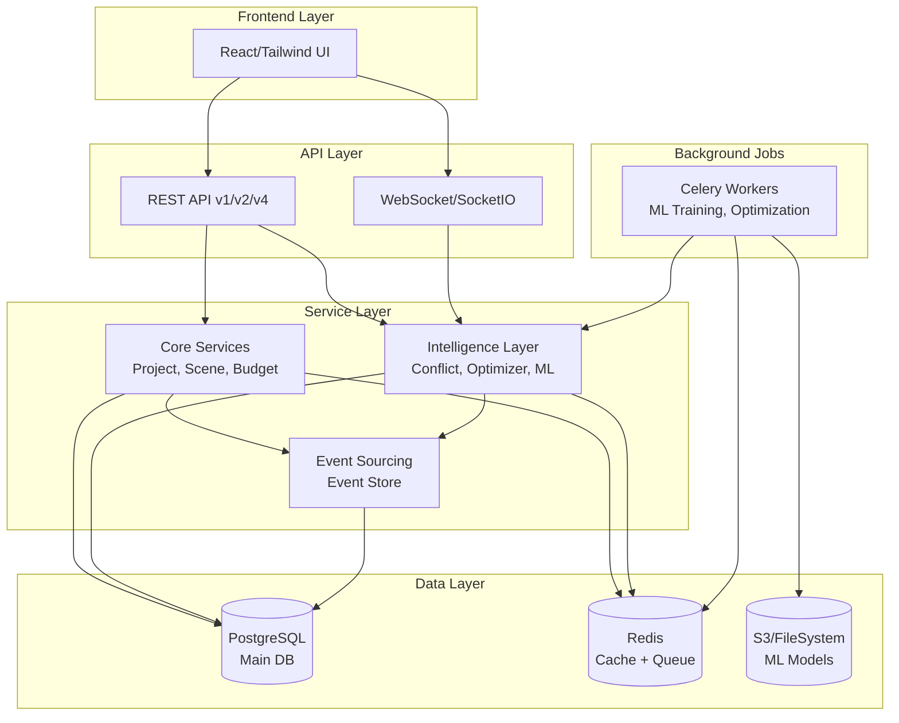

---

## 🏗️ Arquitetura de Camadas

### Layer 1: Presentation (Frontend)

**Location**: Fora do escopo (React app separada)

**Comunicação**:
- REST API: `/api/v1/*`, `/api/v2/*`, `/api/v4/*`
- WebSocket: Real-time updates (conflicts, collaboration)

---

### Layer 2: API Gateway

**Location**: `app/routes/`

```
app/routes/
├── auth.py              # Authentication (login, register)
├── projects.py          # Project CRUD
├── scenes.py            # Scene management
├── budget.py            # Budget management
├── breakdown.py         # Breakdown management
├── call_sheets.py       # Call sheet generation
├── conflicts.py         # ⭐ NOVO (Fase 5.2)
├── schedule_optimization.py  # ⭐ NOVO (Fase 5.3)
└── ml_predictions.py    # ⭐ NOVO (Fase 5.4)
```

**Responsabilidades**:
- Request validation
- Authentication/Authorization
- Response formatting (JSON)
- Rate limiting
- CORS handling

---

### Layer 3: Service Layer (Business Logic)

**Location**: `app/services/`

#### Core Services (Existentes)

```
app/services/
├── project_service.py        # Project operations
├── scene_service.py          # Scene CRUD + Event Sourcing ⭐
├── budget_service.py         # Budget calculations
├── breakdown_service.py      # Breakdown analysis
├── crew_service.py           # Crew management
├── equipment_service.py      # Equipment booking
├── location_service.py       # Location management
├── call_sheet_service.py     # Call sheet generation
└── user_service.py           # User management
```

#### Intelligence Layer (Fase 5 - NOVOS)

```
app/services/
├── event_store_service.py           # ⭐ Event Sourcing (Fase 5.1)
├── conflict_detection_service.py    # ⭐ Conflict Detection (Fase 5.2)
├── schedule_optimizer_service.py    # ⭐ Schedule Optimizer (Fase 5.3)
└── ml_service.py                    # ⭐ ML Predictions (Fase 5.4)
```

---

### Layer 4: ML/Optimization Layer

**Location**: `app/ml/`

```
app/ml/
├── __init__.py
├── models/
│   ├── budget_predictor.py       # Random Forest - Budget prediction
│   ├── schedule_predictor.py     # Random Forest - Delay prediction
│   └── base.py                   # Base ML model class
├── features/
│   ├── budget_features.py        # Feature extraction for budget
│   └── schedule_features.py      # Feature extraction for schedule
├── training/
│   ├── budget_trainer.py         # Training pipeline for budget model
│   └── scheduler_trainer.py      # Training pipeline for schedule model
├── serving/
│   ├── predictor.py              # Production prediction service
│   └── cache.py                  # Prediction caching
└── optimization/
    └── cp_solver.py              # OR-Tools constraint programming
```

---

### Layer 5: Data Layer

#### PostgreSQL (Main Database)

```
Database: cineprod_dev / cineprod_prod

Tables (29 existentes + 4 novos):
├── Core Tables (existentes)
│   ├── projects
│   ├── scenes
│   ├── shots
│   ├── budgets
│   ├── call_sheets
│   ├── users
│   └── ...
└── Intelligence Layer Tables (NOVOS - Fase 5)
    ├── events                    # ⭐ Event Store
    ├── event_snapshots           # ⭐ Event Store snapshots
    ├── event_subscriptions       # ⭐ Event handlers
    └── conflicts                 # ⭐ Detected conflicts
```

#### Redis (Cache + Queue)

```
Redis Usage:
├── Cache Layer
│   ├── scenes:123              # Cached scene data
│   ├── projects:456            # Cached project data
│   └── predictions:budget:789  # Cached ML predictions
└── Celery Broker
    ├── celery:tasks            # Task queue
    └── celery:results          # Task results
```

#### S3 / FileSystem (ML Models)

```
ml_models/
├── budget_predictor_v1.0.pkl
├── budget_predictor_v1.1.pkl
├── schedule_predictor_v1.0.pkl
└── metadata.json
```

---

## 🗂️ Mapa de Módulos

### Módulo 1: Core Application (v2.3.1 Existente)

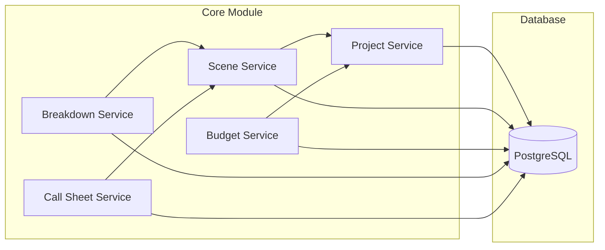

**Status**: ✅ Implementado (v2.3.1)

---

### Módulo 2: Event Sourcing (Fase 5.1)

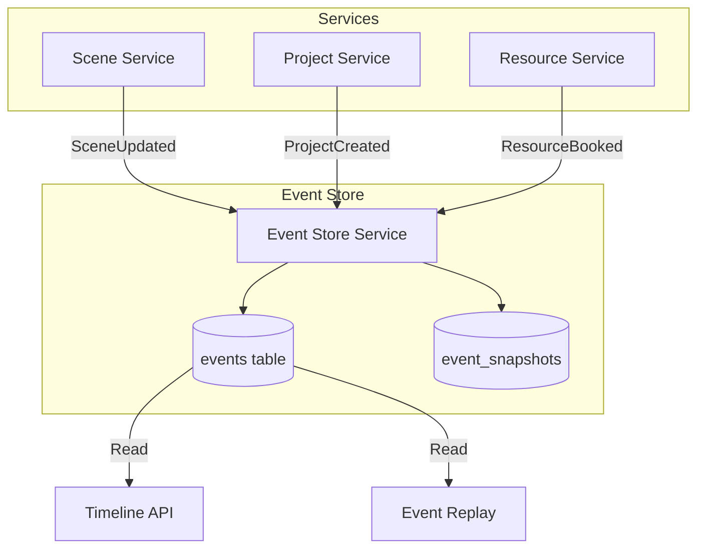

**Status**: 🟡 Planejado (Fase 5.1 Week 3-4)

**Arquivos Novos**:
- `app/models/event.py`
- `app/services/event_store_service.py`
- `app/migrations/xxx_add_event_store.py`

**Arquivos Modificados**:
- `app/services/scene_service.py` (add event logging)

---

### Módulo 3: Conflict Detection (Fase 5.2)

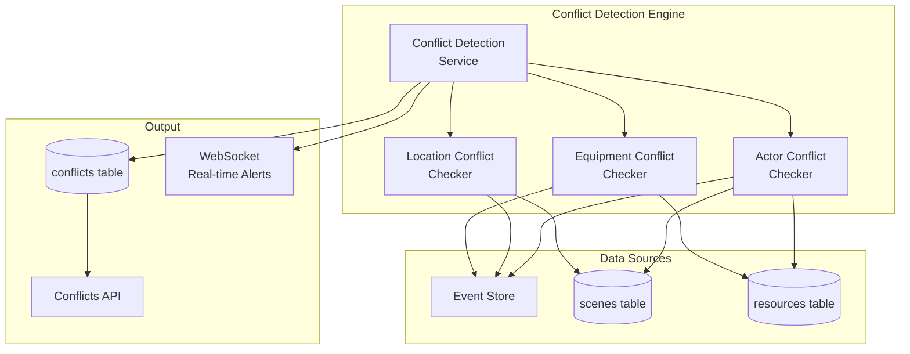

**Status**: 🟡 Planejado (Fase 5.2 Semanas 5-7)

**Arquivos Novos**:
- `app/services/conflict_detection_service.py`
- `app/models/conflict.py`
- `app/routes/conflicts.py`
- `app/websocket/conflict_events.py`
- `app/migrations/xxx_add_conflict_model.py`

---

### Módulo 4: Schedule Optimizer (Fase 5.3)

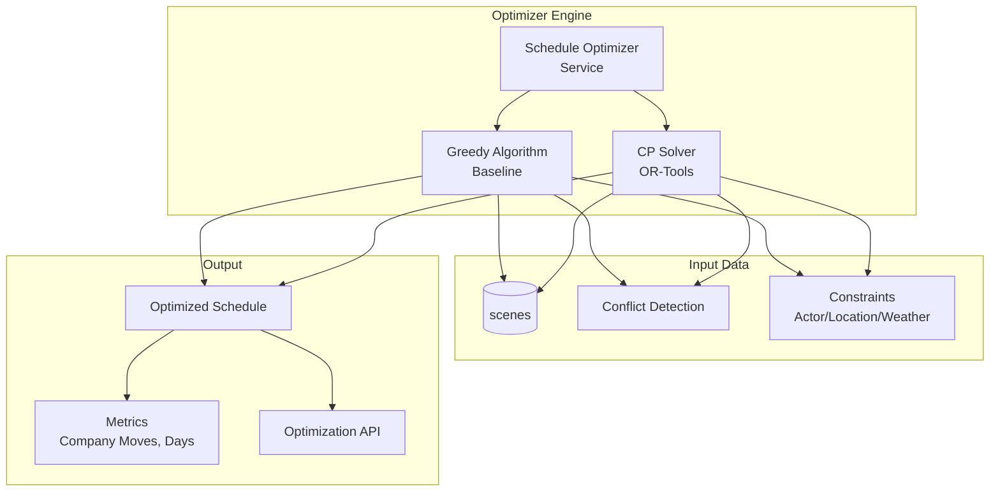

**Status**: 🟡 Planejado (Fase 5.3 Semanas 8-12)

**Arquivos Novos**:
- `app/services/schedule_optimizer_service.py`
- `app/ml/optimization/cp_solver.py`
- `app/routes/schedule_optimization.py`

**Dependências Externas**:
- `ortools==9.8.3296` (Google OR-Tools)

---

### Módulo 5: Predictive Analytics (Fase 5.4)

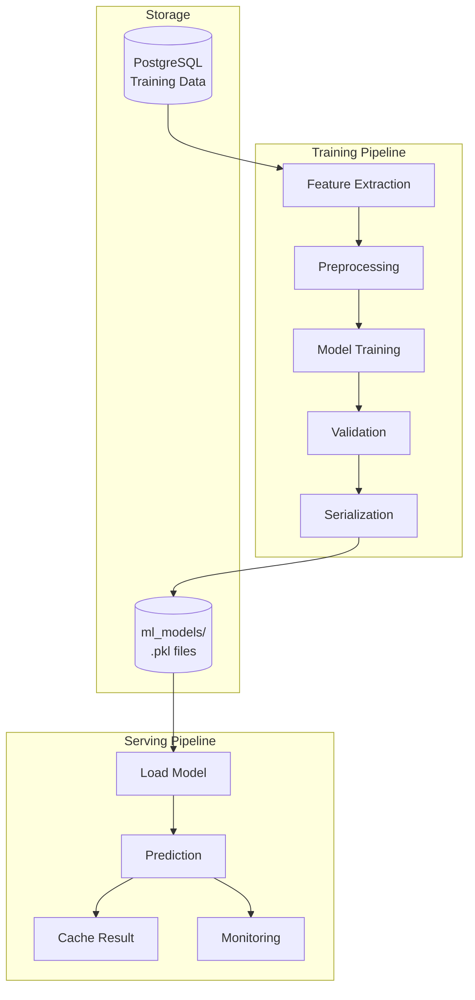

**Status**: 🟡 Planejado (Fase 5.4 Semanas 13-16)

**Arquivos Novos** (10 arquivos):
- `app/ml/__init__.py`
- `app/ml/models/budget_predictor.py`
- `app/ml/features/budget_features.py`
- `app/ml/training/budget_trainer.py`
- `app/ml/serving/predictor.py`
- `app/services/ml_service.py`
- `app/routes/ml_predictions.py`
- `celery_tasks/ml_tasks.py`
- `ml_models/metadata.json`

---

## 🔄 Fluxo de Dados

### Fluxo 1: Scene Update com Event Sourcing

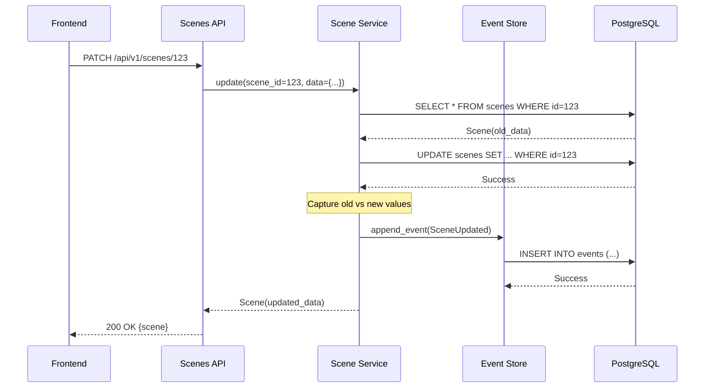

---

### Fluxo 2: Conflict Detection

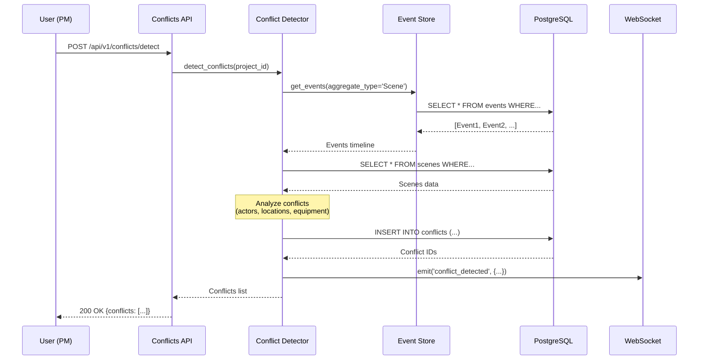

---

### Fluxo 3: Schedule Optimization

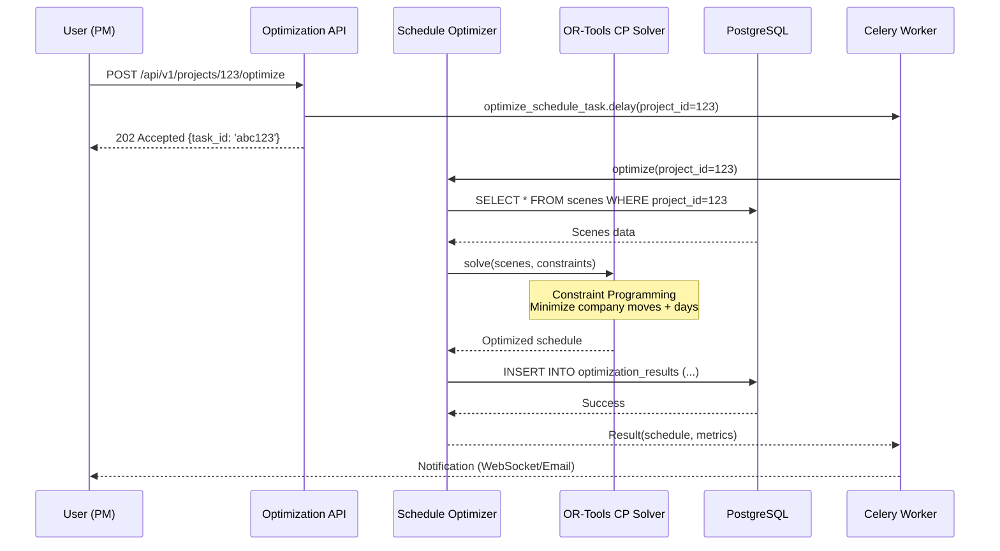

---

### Fluxo 4: ML Budget Prediction

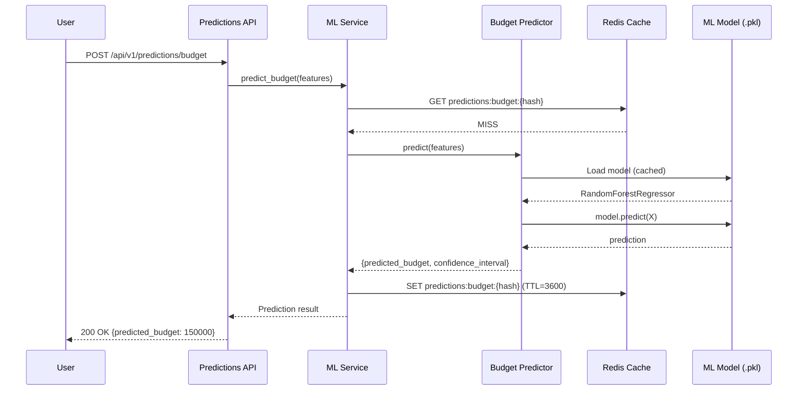

---

## 🔗 Dependências

### Grafo de Dependências entre Módulos

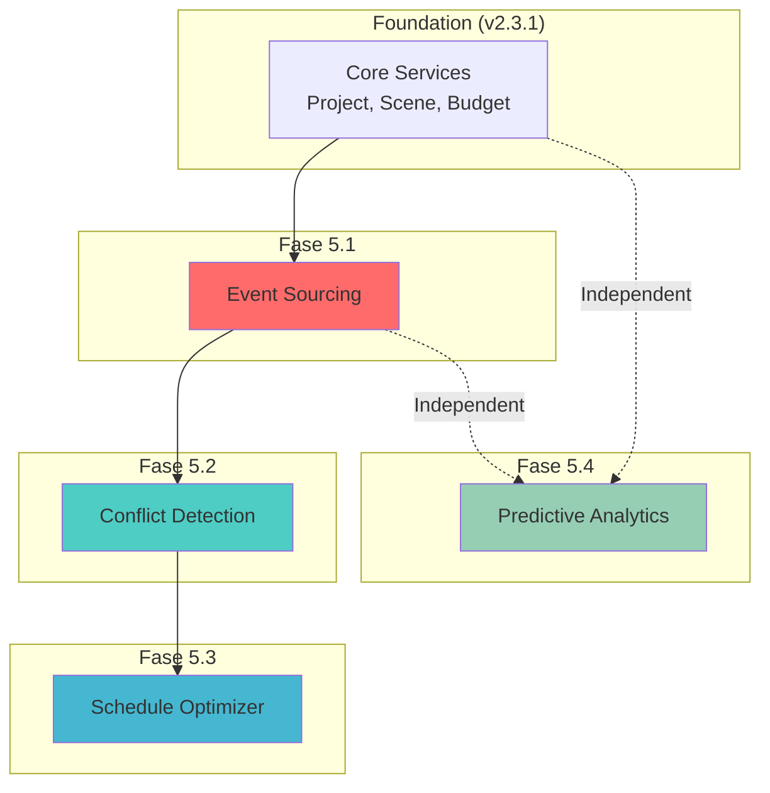

**Ordem de Implementação Obrigatória**:
1. ✅ **Core Services** (já existente)
2. 🟡 **Event Sourcing** (Fase 5.1) - Bloqueador para Conflict Detection
3. 🟡 **Conflict Detection** (Fase 5.2) - Depende de Event Sourcing
4. 🟡 **Schedule Optimizer** (Fase 5.3) - Depende de Conflict Detection
5. 🟡 **Predictive Analytics** (Fase 5.4) - Independente (pode rodar em paralelo)

---

## 🚀 Deployment Architecture

### Production Environment

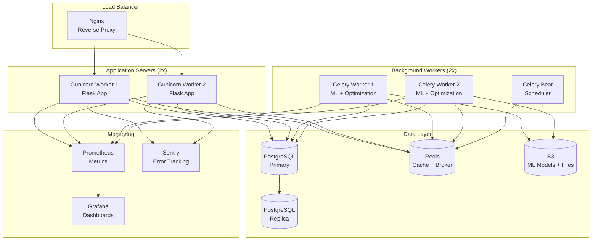

### Container Architecture (Docker)

```
docker-compose.yml:
├── cineprod-app (Flask + Gunicorn)
├── cineprod-worker-1 (Celery)
├── cineprod-worker-2 (Celery)
├── cineprod-beat (Celery Beat)
├── postgres:15 (Database)
├── redis:7 (Cache + Broker)
├── nginx (Reverse Proxy)
├── prometheus (Metrics)
└── grafana (Dashboards)
```

---

## 📁 Directory Structure (Complete)

```
cineprod-flask/
├── app/
│   ├── __init__.py
│   ├── models/              # Database models (29 + 4 novos)
│   │   ├── __init__.py
│   │   ├── project.py
│   │   ├── scene.py
│   │   ├── budget.py
│   │   ├── event.py         # ⭐ NOVO (Fase 5.1)
│   │   └── conflict.py      # ⭐ NOVO (Fase 5.2)
│   ├── services/            # Business logic (19 + 4 novos)
│   │   ├── __init__.py
│   │   ├── project_service.py
│   │   ├── scene_service.py (modified - Event Sourcing) ⭐
│   │   ├── event_store_service.py  # ⭐ NOVO (Fase 5.1)
│   │   ├── conflict_detection_service.py  # ⭐ NOVO (Fase 5.2)
│   │   ├── schedule_optimizer_service.py  # ⭐ NOVO (Fase 5.3)
│   │   └── ml_service.py    # ⭐ NOVO (Fase 5.4)
│   ├── routes/              # API endpoints (15 + 3 novos)
│   │   ├── __init__.py
│   │   ├── projects.py
│   │   ├── scenes.py
│   │   ├── conflicts.py     # ⭐ NOVO (Fase 5.2)
│   │   ├── schedule_optimization.py  # ⭐ NOVO (Fase 5.3)
│   │   └── ml_predictions.py  # ⭐ NOVO (Fase 5.4)
│   ├── ml/                  # ⭐ NOVO MODULE (Fase 5.4)
│   │   ├── __init__.py
│   │   ├── models/
│   │   │   ├── budget_predictor.py
│   │   │   └── schedule_predictor.py
│   │   ├── features/
│   │   │   ├── budget_features.py
│   │   │   └── schedule_features.py
│   │   ├── training/
│   │   │   ├── budget_trainer.py
│   │   │   └── scheduler_trainer.py
│   │   ├── serving/
│   │   │   ├── predictor.py
│   │   │   └── cache.py
│   │   └── optimization/
│   │       └── cp_solver.py  # ⭐ NOVO (Fase 5.3)
│   ├── websocket/
│   │   ├── __init__.py
│   │   └── conflict_events.py  # ⭐ NOVO (Fase 5.2)
│   ├── cache/
│   │   └── redis_client.py  # ⭐ NOVO (Fase 5.1)
│   └── migrations/
│       └── versions/
│           ├── xxx_add_event_store.py  # ⭐ NOVO (Fase 5.1)
│           └── xxx_add_conflict_model.py  # ⭐ NOVO (Fase 5.2)
├── tests/
│   ├── unit/
│   │   ├── test_event_store_service.py  # ⭐ NOVO
│   │   ├── test_conflict_detection_service.py  # ⭐ NOVO
│   │   ├── test_schedule_optimizer_service.py  # ⭐ NOVO
│   │   └── test_ml_service.py  # ⭐ NOVO
│   └── integration/
│       ├── test_conflict_detection_integration.py  # ⭐ NOVO
│       └── test_schedule_optimization_integration.py  # ⭐ NOVO
├── celery_tasks/
│   ├── ml_tasks.py          # ⭐ NOVO (Fase 5.4)
│   └── optimization_tasks.py  # ⭐ NOVO (Fase 5.3)
├── ml_models/               # ⭐ NOVO DIRECTORY
│   ├── budget_predictor_v1.0.pkl
│   ├── schedule_predictor_v1.0.pkl
│   └── metadata.json
├── scripts/
│   └── phase5/              # ⭐ NOVO DIRECTORY
│       ├── check_file_exists.py
│       ├── migrate_file.py
│       ├── sync_manifest.py
│       ├── validate_imports.py
│       └── archive_old_files.py
├── docs/
│   └── fase_5/
│       ├── FILE_MANIFEST.yaml  # ⭐ NOVO
│       ├── MIGRATION_PLAN.md  # ⭐ NOVO
│       ├── ARCHITECTURE_MAP.md  # ⭐ NOVO (este arquivo)
│       └── IMPLEMENTATION_TRACKER.md  # ⭐ NOVO
├── requirements.txt (updated with ML dependencies) ⭐
├── docker-compose.yml (updated with Celery) ⭐
└── celery_app.py (updated with Beat schedule) ⭐
```

---

## 🎯 Resumo

### Arquivos Totais por Fase

| Fase | Novos | Modificados | Depreciados | Total |
|------|-------|-------------|-------------|-------|
| **5.1 Foundation** | 12 | 3 | 2 | 17 |
| **5.2 Conflict Detection** | 4 | 0 | 0 | 4 |
| **5.3 Schedule Optimizer** | 3 | 0 | 0 | 3 |
| **5.4 Predictive Analytics** | 10 | 1 | 0 | 11 |
| **Scripts de Validação** | 5 | 0 | 0 | 5 |
| **TOTAL** | **34** | **4** | **2** | **40** |

### LOC Estimado por Fase

| Fase | LOC Estimado |
|------|--------------|
| Fase 5.1 | 1,280 |
| Fase 5.2 | 630 |
| Fase 5.3 | 770 |
| Fase 5.4 | 1,160 |
| Scripts | 500 |
| **TOTAL** | **4,340** |

---

**Mantido por**: Claude Code + Equipe Digimundo
**Última Atualização**: 2025-11-16
**Versão**: 1.0
