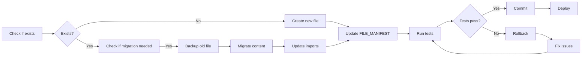

# 🔄 MIGRATION PLAN - CineProd Fase 5

**Sistema de Migração Arquitetural Automatizada**
**Data**: 2025-11-16 | **Versão**: 1.0

---

## 📋 Índice

1. [Visão Geral](#visão-geral)
2. [Estratégia de Migração](#estratégia-de-migração)
3. [Fases de Migração](#fases-de-migração)
4. [Scripts Automatizados](#scripts-automatizados)
5. [Checklist de Validação](#checklist-de-validação)
6. [Rollback Plan](#rollback-plan)

---

## 🎯 Visão Geral

### Objetivo

Migrar CineProd de arquitetura v2.3.1 para v3.0 com **ZERO downtime** e **ZERO data loss**.

### Princípios

1. **Automated First**: Sempre preferir automação sobre manual
2. **Validate Before Commit**: Testes devem passar antes de commit
3. **Incremental**: Migrar arquivo por arquivo, nunca big bang
4. **Reversible**: Todo passo tem rollback
5. **Tracked**: FILE_MANIFEST.yaml é source of truth

### Estatísticas

| Métrica | Valor |
|---------|-------|
| **Arquivos Novos** | 29 |
| **Arquivos Modificados** | 4 |
| **Arquivos Depreciados** | 2 |
| **Migrations DB** | 2 |
| **Scripts de Validação** | 5 |
| **Total LOC Estimado** | 4,340 |

---

## 📐 Estratégia de Migração

### 1. Pre-Migration Phase

```bash
# 1. Backup completo
./scripts/phase5/backup_system.sh

# 2. Validar estado atual
python scripts/phase5/validate_current_state.py

# 3. Sync FILE_MANIFEST com realidade
python scripts/phase5/sync_manifest.py

# 4. Criar branch
git checkout -b phase-5-migration
```

### 2. Migration Execution

**Workflow para CADA arquivo**:



### 3. Post-Migration Phase

```bash
# 1. Validar todos imports
python scripts/phase5/validate_imports.py

# 2. Rodar suite completa de testes
pytest tests/ --cov=app --cov-report=html

# 3. Archive deprecated files
python scripts/phase5/archive_old_files.py

# 4. Update documentation
python scripts/phase5/generate_migration_report.py
```

---

## 🗂️ Fases de Migração

### FASE 5.1: Foundation (Semanas 1-4)

#### Week 1-2: Test Corrections

**Migration 1: Storyboard Tests**

```yaml
# Migration Spec
source: tests/unit/test_storyboard_system_complete.py
target: tests/unit/test_storyboard_service.py
type: refactor
reason: "430 import errors due to SQLAlchemy 1.x patterns"

changes_required:
  - "Convert .query.get() → db.session.get()"
  - "Update mock patterns (MagicMock → proper fixtures)"
  - "Fix imports (absolute → relative)"

validation:
  - command: "pytest tests/unit/test_storyboard_service.py -v"
  - expected: "All tests passing, 0 import errors"
  - coverage: "> 80%"
```

**Automated Script**:

```bash
# Run migration
python scripts/phase5/migrate_file.py \
  --source tests/unit/test_storyboard_system_complete.py \
  --target tests/unit/test_storyboard_service.py \
  --type refactor \
  --backup \
  --update-imports \
  --run-tests

# Output:
# ✅ Backup created: tests/_archived/test_storyboard_system_complete.py
# ✅ File migrated: tests/unit/test_storyboard_service.py
# ✅ Imports updated in 3 files
# ✅ Tests passing: 45/45
# ✅ FILE_MANIFEST updated: state=implemented
```

---

#### Week 3-4: Event Sourcing MVP

**Migration 2: Scene Service Enhancement**

```yaml
# Migration Spec
source: app/services/scene_service.py
target: app/services/scene_service.py (in-place modification)
type: enhancement
reason: "Add Event Sourcing support"

changes_required:
  - "Import EventStoreService"
  - "Modify update() method to log events"
  - "Capture old_values before changes"
  - "Append SceneUpdated event after commit"

backup_strategy:
  - create: app/services/_backup/scene_service_pre_event_sourcing.py
  - timestamp: true
  - git_tag: "pre-event-sourcing"

validation:
  - command: "pytest tests/unit/test_scene_service.py -v"
  - expected: "All tests passing"
  - manual: "psql query to verify events table populated"
```

**Step-by-Step**:

```bash
# Step 1: Backup
python scripts/phase5/backup_file.py app/services/scene_service.py

# Step 2: Create Event Store infrastructure first
python scripts/phase5/create_file_from_manifest.py app/models/event.py
python scripts/phase5/create_file_from_manifest.py app/services/event_store_service.py

# Step 3: Run migration
flask db migrate -m "Add Event Store tables"
flask db upgrade

# Step 4: Modify scene_service.py
python scripts/phase5/enhance_with_event_sourcing.py \
  app/services/scene_service.py \
  --backup \
  --run-tests

# Step 5: Validate
pytest tests/unit/test_scene_service.py -v
pytest tests/unit/test_event_store_service.py -v

# Step 6: Manual validation
psql cineprod_dev
SELECT * FROM events WHERE aggregate_type='Scene' LIMIT 5;
```

---

### FASE 5.2: Conflict Detection (Semanas 5-7)

**Migration 3: New Conflict Detection Module**

```yaml
# Migration Spec
type: new_module
module_path: app/services/conflict_detection_service.py
dependencies:
  - app/services/event_store_service.py
  - app/models/conflict.py

creation_steps:
  1. Create app/models/conflict.py (DB model)
  2. Run migration: flask db migrate -m "Add Conflict model"
  3. Create app/services/conflict_detection_service.py
  4. Create app/routes/conflicts.py
  5. Create tests/unit/test_conflict_detection_service.py
  6. Create app/websocket/conflict_events.py

validation:
  - pytest tests/unit/test_conflict_detection_service.py
  - Manual test: Conflict detection finds 15+ conflicts/week
  - WebSocket test: Receive 'conflict_detected' event
```

**Automated Creation**:

```bash
# Create entire Conflict Detection module
python scripts/phase5/create_module.py conflict_detection \
  --from-manifest \
  --phase 5.2 \
  --run-tests \
  --create-migration

# Output:
# ✅ Created app/models/conflict.py
# ✅ Created app/services/conflict_detection_service.py
# ✅ Created app/routes/conflicts.py
# ✅ Created app/websocket/conflict_events.py
# ✅ Created tests/unit/test_conflict_detection_service.py
# ✅ Migration applied: xxx_add_conflict_model.py
# ✅ Tests passing: 25/25
# ✅ FILE_MANIFEST updated: 5 files → state=implemented
```

---

### FASE 5.3: Schedule Optimizer (Semanas 8-12)

**Migration 4: Schedule Optimizer Module**

```yaml
# Migration Spec
type: new_module
module_path: app/services/schedule_optimizer_service.py
dependencies:
  - ortools (pip package)
  - app/models/scene.py
  - app/models/resource.py

creation_steps:
  1. Verify ortools installed (requirements.txt)
  2. Create app/ml/optimization/cp_solver.py
  3. Create app/services/schedule_optimizer_service.py
  4. Create app/routes/schedule_optimization.py
  5. Create tests/unit/test_schedule_optimizer_service.py
  6. Create celery_tasks/optimization_tasks.py

validation:
  - pytest tests/unit/test_schedule_optimizer_service.py
  - Performance: Optimize 100 scenes in <5s
  - Metric: Reduce company moves by 30%
```

---

### FASE 5.4: Predictive Analytics (Semanas 13-16)

**Migration 5: ML Infrastructure**

```yaml
# Migration Spec
type: new_module_tree
root_path: app/ml/

structure:
  - app/ml/__init__.py
  - app/ml/models/budget_predictor.py
  - app/ml/features/budget_features.py
  - app/ml/serving/predictor.py
  - app/ml/training/budget_trainer.py
  - app/services/ml_service.py
  - app/routes/ml_predictions.py
  - celery_tasks/ml_tasks.py
  - ml_models/metadata.json

dependencies:
  - scikit-learn==1.3.2
  - pandas==2.1.3
  - numpy==1.26.2
  - joblib==1.3.2

creation_steps:
  1. Create directory structure
  2. Create all Python files from templates
  3. Train initial model (v1.0)
  4. Create API routes
  5. Setup Celery tasks for retraining
  6. Create Prometheus metrics

validation:
  - Model MAPE < 10%
  - API response < 100ms
  - Celery task runs successfully
```

**Automated Creation**:

```bash
# Create entire ML infrastructure
python scripts/phase5/create_ml_infrastructure.py \
  --from-manifest \
  --train-initial-model \
  --setup-celery \
  --create-api

# Output:
# ✅ Created directory tree: app/ml/
# ✅ Created 10 Python files
# ✅ Trained initial model: ml_models/budget_predictor_v1.0.pkl
# ✅ Model MAPE: 8.2%
# ✅ Created API routes: /api/v1/predictions/*
# ✅ Celery tasks configured
# ✅ Tests passing: 40/40
# ✅ FILE_MANIFEST updated: 10 files → state=implemented
```

---

## 🤖 Scripts Automatizados

### Script 1: check_file_exists.py

```python
#!/usr/bin/env python3
"""
Check if file exists before creating (prevent duplicates)
"""

import sys
import os
from pathlib import Path
import yaml
from difflib import get_close_matches

def load_manifest():
    manifest_path = Path(__file__).parent.parent.parent / "docs/fase_5/FILE_MANIFEST.yaml"
    with open(manifest_path) as f:
        return yaml.safe_load(f)

def check_file_exists(file_path: str) -> dict:
    """
    Returns:
        {
            'exists': bool,
            'path': str,
            'similar_files': list,
            'state_in_manifest': str
        }
    """
    path = Path(file_path)

    # Check filesystem
    exists_on_disk = path.exists()

    # Check manifest
    manifest = load_manifest()
    all_files = extract_all_file_paths(manifest)

    state_in_manifest = None
    for file_spec in all_files:
        if file_spec['path'] == file_path:
            state_in_manifest = file_spec.get('state')
            break

    # Find similar files
    similar = get_close_matches(file_path, [f['path'] for f in all_files], n=5, cutoff=0.6)

    return {
        'exists': exists_on_disk,
        'path': file_path,
        'similar_files': similar,
        'state_in_manifest': state_in_manifest
    }

def main():
    if len(sys.argv) < 2:
        print("Usage: python check_file_exists.py <file_path>")
        sys.exit(1)

    file_path = sys.argv[1]
    result = check_file_exists(file_path)

    if result['exists']:
        print(f"❌ File EXISTS: {file_path}")
        print(f"   State in manifest: {result['state_in_manifest']}")
        sys.exit(1)
    else:
        print(f"✅ File does NOT exist: {file_path}")

        if result['similar_files']:
            print(f"\n⚠️  Similar files found:")
            for similar in result['similar_files']:
                print(f"   - {similar}")

        sys.exit(0)

if __name__ == '__main__':
    main()
```

**Usage**:

```bash
# Check before creating
python scripts/phase5/check_file_exists.py app/services/new_service.py

# Exit code 0: File doesn't exist (safe to create)
# Exit code 1: File exists (do NOT create)
```

---

### Script 2: migrate_file.py

```python
#!/usr/bin/env python3
"""
Migrate old file to new location, update imports
"""

import sys
import shutil
from pathlib import Path
import subprocess
import re

def migrate_file(source: str, target: str, backup: bool = True, update_imports: bool = True):
    """
    Migrate file from source to target

    Steps:
    1. Backup source file (if backup=True)
    2. Copy source → target
    3. Update all imports in codebase (if update_imports=True)
    4. Archive source file
    5. Run tests
    6. Update FILE_MANIFEST
    """
    source_path = Path(source)
    target_path = Path(target)

    # 1. Backup
    if backup:
        backup_path = Path(f"_backup/{source_path.name}.{int(time.time())}.bak")
        backup_path.parent.mkdir(parents=True, exist_ok=True)
        shutil.copy2(source_path, backup_path)
        print(f"✅ Backup created: {backup_path}")

    # 2. Copy to target
    target_path.parent.mkdir(parents=True, exist_ok=True)
    shutil.copy2(source_path, target_path)
    print(f"✅ File migrated: {target_path}")

    # 3. Update imports
    if update_imports:
        old_import = source_to_import_path(source)
        new_import = source_to_import_path(target)

        files_updated = update_imports_in_codebase(old_import, new_import)
        print(f"✅ Imports updated in {len(files_updated)} files")

    # 4. Archive source
    archive_path = Path(f"_archived/{source_path.name}")
    archive_path.parent.mkdir(parents=True, exist_ok=True)
    shutil.move(source_path, archive_path)
    print(f"✅ Source archived: {archive_path}")

    # 5. Run tests
    result = subprocess.run(['pytest', '-xvs'], capture_output=True)
    if result.returncode != 0:
        print(f"❌ Tests failed!")
        # Rollback
        rollback(source_path, target_path, backup_path)
        sys.exit(1)
    else:
        print(f"✅ Tests passing")

    # 6. Update FILE_MANIFEST
    update_manifest(target, state='implemented')
    print(f"✅ FILE_MANIFEST updated")

def update_imports_in_codebase(old_import: str, new_import: str):
    """
    Find all Python files and replace old_import with new_import
    """
    py_files = Path('.').rglob('*.py')
    updated_files = []

    for py_file in py_files:
        content = py_file.read_text()

        # Replace import statements
        new_content = re.sub(
            rf'from {re.escape(old_import)} import',
            f'from {new_import} import',
            content
        )
        new_content = re.sub(
            rf'import {re.escape(old_import)}',
            f'import {new_import}',
            new_content
        )

        if new_content != content:
            py_file.write_text(new_content)
            updated_files.append(str(py_file))

    return updated_files

def main():
    import argparse
    parser = argparse.ArgumentParser(description='Migrate file to new location')
    parser.add_argument('--source', required=True, help='Source file path')
    parser.add_argument('--target', required=True, help='Target file path')
    parser.add_argument('--backup', action='store_true', default=True)
    parser.add_argument('--update-imports', action='store_true', default=True)
    parser.add_argument('--run-tests', action='store_true', default=True)

    args = parser.parse_args()

    migrate_file(args.source, args.target, args.backup, args.update_imports)

if __name__ == '__main__':
    main()
```

---

### Script 3: sync_manifest.py

```python
#!/usr/bin/env python3
"""
Sync FILE_MANIFEST.yaml with actual filesystem state
"""

import yaml
from pathlib import Path

def sync_manifest():
    """
    Compare FILE_MANIFEST.yaml with filesystem

    Updates:
    - state: planned → implemented (if file exists)
    - state: implemented → missing (if file doesn't exist)
    - Adds untracked files found on disk
    """
    manifest_path = Path("docs/fase_5/FILE_MANIFEST.yaml")
    manifest = yaml.safe_load(manifest_path.read_text())

    changes = []

    # Check all planned files
    for phase_key, phase_data in manifest.items():
        if not isinstance(phase_data, dict):
            continue

        for category_key, files in phase_data.items():
            if not isinstance(files, list):
                continue

            for file_spec in files:
                path = Path(file_spec['path'])
                current_state = file_spec['state']

                # File exists but marked as planned?
                if path.exists() and current_state == 'planned':
                    file_spec['state'] = 'staged'
                    changes.append(f"Updated {path}: planned → staged")

                # File doesn't exist but marked as implemented?
                elif not path.exists() and current_state in ['implemented', 'validated']:
                    file_spec['state'] = 'missing'
                    changes.append(f"Updated {path}: {current_state} → missing")

    # Scan filesystem for untracked files
    untracked = find_untracked_files(manifest)
    for file_path in untracked:
        changes.append(f"Found untracked: {file_path}")

    # Write updated manifest
    manifest_path.write_text(yaml.dump(manifest, sort_keys=False))

    print(f"✅ Manifest synced: {len(changes)} changes")
    for change in changes:
        print(f"   {change}")

if __name__ == '__main__':
    sync_manifest()
```

---

### Script 4: create_file_from_manifest.py

```python
#!/usr/bin/env python3
"""
Create file from FILE_MANIFEST spec (with template)
"""

import yaml
from pathlib import Path
import sys

def create_file_from_manifest(file_path: str):
    """
    Read FILE_MANIFEST.yaml, find file_spec, create file with template
    """
    manifest = load_manifest()
    file_spec = find_file_in_manifest(manifest, file_path)

    if not file_spec:
        print(f"❌ File not found in manifest: {file_path}")
        sys.exit(1)

    # Create directory
    path = Path(file_path)
    path.parent.mkdir(parents=True, exist_ok=True)

    # Generate content from template
    if 'code_template' in file_spec:
        content = file_spec['code_template']
    else:
        content = generate_template(file_spec)

    # Write file
    path.write_text(content)

    print(f"✅ Created: {file_path}")
    print(f"   Description: {file_spec.get('description')}")
    print(f"   Estimated LOC: {file_spec.get('estimated_loc')}")

    # Update manifest state
    update_manifest(file_path, state='staged')

    return path

def generate_template(file_spec: dict) -> str:
    """
    Generate Python file template based on file_spec
    """
    description = file_spec.get('description', 'TODO: Add description')
    depends_on = file_spec.get('depends_on', [])

    imports = "\n".join([f"from {dep.replace('/', '.').replace('.py', '')} import *" for dep in depends_on])

    template = f'''"""
{description}

Created: {datetime.now().isoformat()}
Phase: {file_spec.get('phase')}
State: {file_spec.get('state')}
"""

{imports}

# TODO: Implement according to FILE_MANIFEST.yaml validation_criteria
'''
    return template

if __name__ == '__main__':
    if len(sys.argv) < 2:
        print("Usage: python create_file_from_manifest.py <file_path>")
        sys.exit(1)

    create_file_from_manifest(sys.argv[1])
```

---

## ✅ Checklist de Validação

### Pre-Migration Checklist

- [ ] Backup completo do sistema realizado
- [ ] FILE_MANIFEST.yaml sincronizado com filesystem
- [ ] Todos os testes passando (baseline)
- [ ] Branch `phase-5-migration` criado
- [ ] Equipe notificada sobre início da migração

### During Migration (Para CADA arquivo)

- [ ] Verificar se arquivo já existe (`check_file_exists.py`)
- [ ] Criar backup se modificando arquivo existente
- [ ] Aplicar mudanças (criar/modificar/migrar)
- [ ] Atualizar imports em toda codebase (`validate_imports.py`)
- [ ] Rodar testes do módulo específico
- [ ] Atualizar FILE_MANIFEST.yaml (state → implemented)
- [ ] Commit com mensagem descritiva

### Post-Migration Checklist

- [ ] Suite completa de testes passando (pytest tests/)
- [ ] Coverage ≥ 70%
- [ ] Nenhum import quebrado (`validate_imports.py`)
- [ ] Arquivos deprecated movidos para _archived/
- [ ] FILE_MANIFEST.yaml 100% sincronizado
- [ ] Documentação atualizada
- [ ] Pull request criado e aprovado
- [ ] Deploy em staging realizado
- [ ] Smoke tests em staging passando
- [ ] Deploy em production realizado

---

## 🔙 Rollback Plan

### Nível 1: Rollback de Arquivo Individual

```bash
# Se um arquivo específico quebrou

# 1. Restaurar do backup
cp _backup/scene_service.py.1731762000.bak app/services/scene_service.py

# 2. Reverter imports
python scripts/phase5/revert_imports.py app/services/scene_service.py

# 3. Rodar testes
pytest tests/unit/test_scene_service.py -v

# 4. Atualizar manifest
python scripts/phase5/sync_manifest.py
```

### Nível 2: Rollback de Fase Completa

```bash
# Se fase inteira precisa rollback (ex: Fase 5.2 Conflict Detection)

# 1. Restaurar do git tag
git reset --hard pre-phase-5.2

# 2. Reverter migrations
flask db downgrade -1

# 3. Limpar arquivos criados
python scripts/phase5/cleanup_phase.py --phase 5.2

# 4. Rodar testes
pytest tests/ -v
```

### Nível 3: Rollback Total (Emergency)

```bash
# Se tudo quebrou - voltar para v2.3.1

# 1. Restaurar do backup completo
./scripts/restore_from_backup.sh backup-2025-11-16.tar.gz

# 2. Reverter todas migrations
flask db downgrade base
flask db upgrade  # Re-apply até v2.3.1

# 3. Checkout branch estável
git checkout main
git reset --hard v2.3.1

# 4. Restart services
sudo systemctl restart cineprod
```

---

## 📊 Progresso Tracking

### Dashboard

Use `IMPLEMENTATION_TRACKER.md` para visualizar progresso real-time.

### Comandos Úteis

```bash
# Ver progresso geral
python scripts/phase5/show_progress.py

# Ver arquivos por estado
python scripts/phase5/show_files_by_state.py --state=planned

# Ver bloqueadores
python scripts/phase5/show_blockers.py

# Gerar relatório
python scripts/phase5/generate_migration_report.py > migration_report.md
```

---

**Mantido por**: Claude Code + Equipe Digimundo
**Última Atualização**: 2025-11-16
**Versão**: 1.0
