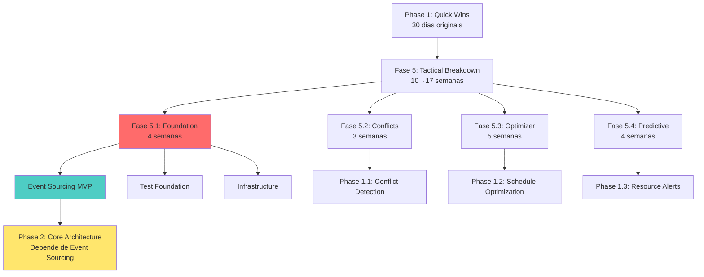

# 🗺️ Diagrama de Relacionamento: Phases vs Fases

**Última Atualização**: 2025-11-16
**Propósito**: Esclarecer a relação entre a estrutura estratégica (Phase 1-4) e a estrutura tática (Fase 5.1-5.4)

---

## 📊 Visão Geral

```
ESTRUTURA ESTRATÉGICA          ESTRUTURA TÁTICA
(Master Plan - 10 meses)       (Upgrade Guide - 10 semanas)
━━━━━━━━━━━━━━━━━━━━━━━━━     ━━━━━━━━━━━━━━━━━━━━━━━━━━━

┌─ Phase 1: Quick Wins         ┌─ Fase 5.1: Foundation
│  (30 dias)                    │  (2→4 semanas - AJUSTADO)
│  - Conflict Detection         │  - Corrigir 175 testes
│  - Audit Trail                │  - SQLAlchemy 2.0 migration
│  - Resource Alerts            │  - Redis/Celery setup
│                               │  - Event Sourcing MVP ✨ NOVO
│                               │
├─ Phase 1 continua...          ├─ Fase 5.2: Conflict Detection
                                │  (2→3 semanas - AJUSTADO)
                                │  - Implementar Conflict Engine
                                │  - BIM-inspired clash detection
                                │
                                ├─ Fase 5.3: Schedule Optimizer
                                │  (3→5 semanas - AJUSTADO)
                                │  - Greedy algorithm MVP
                                │  - CP Solver integration
                                │
                                └─ Fase 5.4: Predictive Analytics
                                   (2→4 semanas - AJUSTADO)
                                   - ARIMA time-series
                                   - Budget prediction

┌─ Phase 2: Core Architecture  ← DEPENDE de Fase 5 completa
│  (90 dias)
│  - CRDT (postponed)
│  - Event Sourcing (moved)
│  - CP Solver (started in 5.3)
│  - Federated Models
│
├─ Phase 3: AI Features
│  (120 dias)
│  - AI Scheduling (RL)
│  - Conflict Predictor (ML)
│  - Semantic Diff (NLP)
│
└─ Phase 4: Platform Evolution
   (60 dias)
   - Plugin System
   - API Marketplace
   - BPMN Workflows
```

---

## 🔗 Relacionamento Hierárquico

### Fase 5 = Implementação Tática de Phase 1 + Foundation



---

## ⚠️ MUDANÇAS CRÍTICAS DO PLANO ORIGINAL

### O Que Mudou?

| Item | Original | Ajustado | Razão |
|------|----------|----------|-------|
| **Fase 5 Total** | 10 semanas | **17 semanas** | Fundação fraca detectada |
| **Fase 5.1** | 2 semanas | **4 semanas** | 175 testes + Event Sourcing |
| **Fase 5.2** | 2 semanas | **3 semanas** | Depende de Event Sourcing |
| **Fase 5.3** | 3 semanas | **5 semanas** | CP Solver complexo |
| **Fase 5.4** | 2 semanas | **4 semanas** | ML infra precisa setup |
| **Event Sourcing** | Phase 2 | **Fase 5.1** | Bloqueador crítico |

### Por Que Event Sourcing Foi Movido?

**Problema Detectado:**
```
Phase 1.1 (Conflict Detection) PRECISA de:
→ Histórico de mudanças em cenas/recursos
→ Temporal queries (quando conflito começou?)
→ Event replay para debugging

Mas Event Sourcing estava planejado para Phase 2 (90 dias depois)!
```

**Solução:**
- Implementar Event Sourcing MVP em Fase 5.1
- Apenas eventos críticos: SceneUpdated, ResourceBooked, ConflictDetected
- Permite Conflict Detection funcionar corretamente em Fase 5.2

---

## 📅 Timeline Comparativo

### ANTES (Plano Original - Irrealista)

```
Semana 1-2  : Fase 5.1 Foundation
Semana 3-4  : Fase 5.2 Conflicts
Semana 5-7  : Fase 5.3 Optimizer
Semana 8-9  : Fase 5.4 Predictive
Semana 10   : Testing & Deploy
━━━━━━━━━━━━━━━━━━━━━━━━━━━━━━━━
TOTAL: 10 semanas (70 dias)

PROBLEMA: Assumia fundação pronta, Event Sourcing existente, 0 testes falhando
```

### DEPOIS (Plano Ajustado - Realista)

```
FASE 5.1: FOUNDATION (4 semanas)
━━━━━━━━━━━━━━━━━━━━━━━━━━━━━━━━
Semana 1    : Corrigir testes críticos (75 de 175)
Semana 2    : Corrigir testes restantes (100 de 175)
Semana 3    : SQLAlchemy 2.0 migration + Redis/Celery
Semana 4    : Event Sourcing MVP (SceneEvent, ResourceEvent)

FASE 5.2: CONFLICT DETECTION (3 semanas)
━━━━━━━━━━━━━━━━━━━━━━━━━━━━━━━━
Semana 5    : Conflict Detection Engine (usando Event Store)
Semana 6    : BIM-inspired clash detection
Semana 7    : Real-time conflict alerts via WebSocket

FASE 5.3: SCHEDULE OPTIMIZER (5 semanas)
━━━━━━━━━━━━━━━━━━━━━━━━━━━━━━━━
Semana 8-9  : Greedy algorithm MVP
Semana 10-11: CP Solver integration (OR-Tools)
Semana 12   : Performance optimization & caching

FASE 5.4: PREDICTIVE ANALYTICS (4 semanas)
━━━━━━━━━━━━━━━━━━━━━━━━━━━━━━━━
Semana 13   : ML infrastructure setup (scikit-learn)
Semana 14-15: ARIMA time-series models
Semana 16   : Budget prediction integration

FASE 5.5: TESTING & DEPLOYMENT (1 semana)
━━━━━━━━━━━━━━━━━━━━━━━━━━━━━━━━
Semana 17   : Integration testing, performance validation, deploy
━━━━━━━━━━━━━━━━━━━━━━━━━━━━━━━━
TOTAL: 17 semanas (119 dias)
```

---

## 🎯 Critical Path (Caminho Crítico)

### Dependências Sequenciais

```
┌─────────────────────────────────────────────────────────────┐
│ FASE 5.1: Foundation (4 semanas)                            │
│ ├─ Testes corrigidos (2 sem)     ← BLOQUEADOR              │
│ ├─ SQLAlchemy 2.0 (1 sem)        ← BLOQUEADOR              │
│ └─ Event Sourcing MVP (1 sem)    ← BLOQUEADOR CRÍTICO      │
└──────────────────┬──────────────────────────────────────────┘
                   │ ✅ Pode avançar
                   ▼
┌─────────────────────────────────────────────────────────────┐
│ FASE 5.2: Conflict Detection (3 semanas)                    │
│ ├─ Conflict Engine                                          │
│ └─ Real-time alerts               ← Usa Event Store         │
└──────────────────┬──────────────────────────────────────────┘
                   │ ⚠️ Pode rodar em paralelo com 5.3
                   ▼
┌─────────────────────────────────────────────────────────────┐
│ FASE 5.3: Schedule Optimizer (5 semanas)                    │
│ ├─ Greedy algorithm                                         │
│ └─ CP Solver                      ← Independente           │
└──────────────────┬──────────────────────────────────────────┘
                   │ ⚠️ Pode rodar em paralelo com 5.4
                   ▼
┌─────────────────────────────────────────────────────────────┐
│ FASE 5.4: Predictive Analytics (4 semanas)                  │
│ ├─ ML setup                                                 │
│ └─ ARIMA models                   ← Independente           │
└─────────────────────────────────────────────────────────────┘
```

### Oportunidades de Paralelização

**Após Fase 5.1 completa:**

```
      ┌──────────────────────┐
      │ Fase 5.1 COMPLETA    │
      │ (Semana 4)           │
      └──────┬───────────────┘
             │
        ┌────┴────┐
        │         │
        ▼         ▼
    ┌─────┐   ┌─────┐
    │ 5.2 │   │ 5.3 │  ← Podem rodar em PARALELO
    │ 3sem│   │ 5sem│     (equipes diferentes)
    └──┬──┘   └──┬──┘
       │         │
       └────┬────┘
            ▼
        ┌─────┐
        │ 5.4 │
        │ 4sem│
        └─────┘
```

**Ganho de Tempo com Paralelização:**
- Sequencial: 17 semanas
- Paralelo (5.2 + 5.3): 14 semanas (-3 semanas = -18%)

**Requisito:** 2 desenvolvedores trabalhando em features diferentes

---

## 📊 Métricas de Progresso

### Como Medir Sucesso em Cada Fase

| Fase | Métrica de Entrada | Métrica de Saída | Critério de Aprovação |
|------|-------------------|------------------|----------------------|
| **5.1** | 175 testes falhando<br/>37% cobertura<br/>323 `.query.` | 0 testes falhando<br/>70% cobertura<br/>0 `.query.` | ✅ All tests green<br/>✅ Event Store funcional |
| **5.2** | 0 conflitos detectados | 15 conflitos/semana detectados | ✅ 80% de conflitos reais detectados |
| **5.3** | 8h planejamento manual | 2h planejamento otimizado | ✅ -75% tempo<br/>✅ -30% company moves |
| **5.4** | 0% previsão orçamento | ±10% precisão previsão | ✅ MAPE <10% |

---

## ⚡ Quick Reference

### "Onde Estamos?" → Use Este Mapa

| Se você quer... | Vá para... |
|----------------|-----------|
| Visão estratégica de 10 meses | **02_IMPLEMENTATION_MASTER_PLAN.md** (Phase 1-4) |
| Plano tático de 17 semanas | **09_UPGRADE_MIGRATION_GUIDE.md** (Fase 5.1-5.4) |
| Relação entre os dois | **Este documento (PHASE_RELATIONSHIP_DIAGRAM.md)** |
| Progresso atual | **PHASE_5.1_PROGRESS_REPORT.md** |
| Próximos passos imediatos | **PHASE_5.1_IMPLEMENTATION_PLAN.md** |

---

## 🔄 Atualização do Master Plan

**IMPORTANTE:** Este diagrama reflete ajustes ao plano original baseados em:
1. Análise profunda do sistema atual (FASE5_CROSS_REFERENCE_ANALYSIS.md)
2. Detecção de gaps críticos (175 testes, Event Sourcing ausente)
3. Reconciliação de métricas (37% vs 70% cobertura assumida)

**Status de Aprovação:**
- ✅ Análise técnica completa
- ⏳ Aprovação stakeholder pendente
- ⏳ Atualização de 02_MASTER_PLAN pendente

---

**Criado**: 2025-11-16
**Mantido por**: Claude Code + Equipe Digimundo
**Versão**: 1.0 (primeira versão reconciliada)
