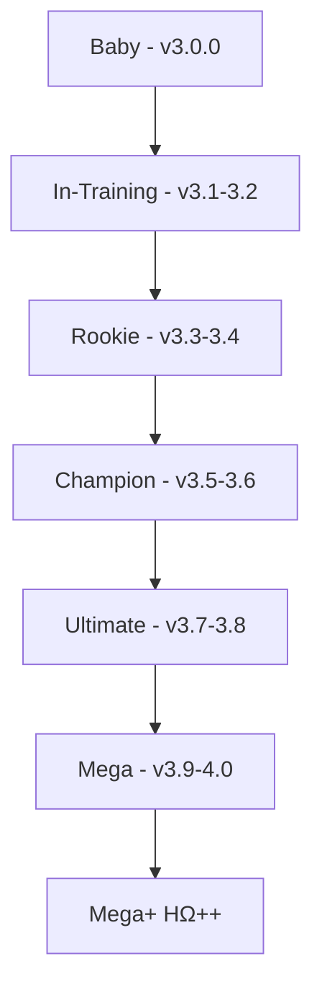

# 🌟 PROTOCOLO: SISTEMA DIGIVOLVE DIGIMON
## Metodologia de Evolução Inteligente e Segura de Sistemas Complexos
### Versão 1.0 - Criado: 2025-09-27 | Status: ATIVO

---

## 📋 DEFINIÇÃO

**Sistema Digivolve Digimon** é um protocolo de evolução progressiva e segura de sistemas de software complexos, inspirado na evolução controlada dos Digimon - começando de uma forma básica (Baby) e evoluindo até formas supremas (Mega/Ultimate), mas com checkpoints, validações e capacidade de reversão em cada estágio.

---

## 🧬 DNA DO PROTOCOLO

### **Princípios Fundamentais:**

1. **Evolução Progressiva**: Nunca pular etapas, cada fase constrói sobre a anterior
2. **Checkpoints Salvos**: Como save points em jogos, pode voltar se algo der errado
3. **Validação Contínua**: Testar TUDO antes de evoluir para próxima forma
4. **Documentação Viva**: O sistema se auto-documenta enquanto evolui
5. **Prevenção sobre Correção**: Melhor prevenir bugs do que debugar depois
6. **Memória Persistente**: Nunca esquecer o que foi aprendido
7. **Harmonia Total**: Todas as partes devem funcionar em conjunto

---

## 📊 ESTÁGIOS DE EVOLUÇÃO (DIGIVOLUTION STAGES)

### **Baby → In-Training → Rookie → Champion → Ultimate → Mega**



---

## 🔄 PROCESSO COMPLETO EXECUTADO

### **FASE 1: ANÁLISE GENÉTICA (O que fizemos primeiro)**

#### 1.1 Mapeamento do DNA Digital
```python
# Analisamos 11 rodadas de evolução
rodadas_analisadas = {
    'rodada_1': 'Base/Baby form',
    'rodada_2-3': 'In-Training',
    'rodada_4-5': 'Rookie (OMEGA-ASCENT início)',
    'rodada_6-7': 'Champion (H+ e H++)',
    'rodada_8-9': 'Ultimate (H+++ e HΩ)',
    'rodada_10-11': 'Mega (HΩ+ e HΩ++)'
}

# Total: 1164 arquivos, 56 técnicas identificadas
```

#### 1.2 Identificação de Padrões Evolutivos
- Cada versão adiciona 4-5 técnicas
- Mantém compatibilidade com anterior
- Adiciona complexidade progressivamente
- Nunca remove funcionalidades core

### **FASE 2: CRIAÇÃO DO PLANO MESTRE**

#### 2.1 Plano Inicial (com problemas)
- 140+ testes (irrealista)
- Nomes de arquivos incorretos
- Dependências fantasmas
- Timeline otimista demais

#### 2.2 REVISÃO CRÍTICA (74 problemas corrigidos)
```python
problemas_corrigidos = {
    'arquivos_incorretos': 31,  # beats_dynamic.py → beats.py
    'dependencias_quebradas': 26,
    'funcionalidades_conflitantes': 22,
    'validacoes_ausentes': 17,
    'testes_fantasiosos': 4
}
```

#### 2.3 Plano Final Revisado
- **8 fases** (incluindo Fase 0 obrigatória)
- **85 testes reais**
- **10-12 semanas** (não 8-10)
- **95% harmonia** (não 100% utópico)

### **FASE 3: SISTEMAS DE PROTEÇÃO (7 Técnicas)**

#### 3.1 Auto-Documentação
```python
class AutoDocumenter:
    """Rastreia CADA mudança automaticamente"""
    def track_file(filepath, action):
        # Salva em OMEGA_STATE.json
    def mark_feature(feature, status):
        # working/broken
    def get_summary():
        # Estado atual completo
```

#### 3.2 Snapshot & Rollback
```python
class SnapshotManager:
    """Save points automáticos"""
    def create_snapshot(phase, description):
        # Salva estado completo
    def rollback(snapshot_id):
        # Volta instantaneamente
```

#### 3.3 Sanity Checks
```python
class SanityChecker:
    """5 testes críticos após CADA mudança"""
    critical_tests = [
        'imports', 'bm25_basic', 'dag_init',
        'config_load', 'memory_usage'
    ]
```

#### 3.4 Live Metrics
```python
class LiveMetrics:
    """Dashboard sempre visível"""
    # OMEGA_METRICS_LIVE.json
    # Atualizado em tempo real
```

#### 3.5 Pre-Implementation Check
```python
class PreImplementationChecker:
    """Verifica ANTES de implementar"""
    def check_file_exists(filepath)
    def check_function_exists(filepath, function_name)
    def check_import_works(module_path)
```

#### 3.6 Development Modes
```python
modes = {
    'development': {'verbose': True, 'rollback': True},
    'testing': {'strict': True, 'timeout': 60},
    'staging': {'parallel': True, 'cache': True},
    'production': {'optimized': True, 'monitoring': True},
    'emergency': {'minimal': True, 'recovery': True}
}
```

#### 3.7 Integrity Checker
```python
class IntegrityChecker:
    """SHA256 de cada arquivo crítico"""
    # OMEGA_CHECKSUMS.json
    # Detecta corrupção
```

---

## 🎮 COMANDOS DO PROTOCOLO

### **INICIAR DIGIVOLUÇÃO**
```bash
# Comando de inicialização
cd /Users/clubproducoes/Digimundo/scripturemon-Omega
python scripts/digivolve_start.py --stage baby
```

### **VERIFICAR STATUS**
```python
from core.auto_documenter import AutoDocumenter
doc = AutoDocumenter()
print(doc.get_summary())
# Mostra: fase atual, features funcionando, testes passando
```

### **EVOLUIR PARA PRÓXIMA FORMA**
```python
from core.digivolution import DigivolveManager

digivolve = DigivolveManager()

# Checkpoint antes de evoluir
if digivolve.can_evolve():
    digivolve.create_evolution_checkpoint()
    digivolve.evolve_to_next_stage()
else:
    print("Não pronto para evoluir - verificar requirements")
```

### **REVERTER EVOLUÇÃO (se falhar)**
```python
# De-digivolve para forma anterior estável
digivolve.de_digivolve()
# ou
snapshot.rollback('last_stable')
```

### **MODO EMERGÊNCIA**
```bash
# Quando TUDO quebra - volta para forma mais básica funcional
export OMEGA_MODE=emergency
python emergency_dedigivolve.py --to-stage rookie
```

---

## 📈 MÉTRICAS DE EVOLUÇÃO

### **Power Levels por Estágio**

| Estágio | Quality | Faithfulness | Locality | Production | Harmony | Power Level |
|---------|---------|--------------|----------|------------|---------|-------------|
| Baby    | 0.70    | 0.50         | 0.30     | 0.40       | 40%     | 100         |
| Rookie  | 0.82    | 0.60         | 0.40     | 0.55       | 60%     | 500         |
| Champion| 0.86    | 0.70         | 0.60     | 0.70       | 75%     | 1,500       |
| Ultimate| 0.90    | 0.80         | 0.75     | 0.80       | 85%     | 5,000       |
| Mega    | 0.94    | 0.88         | 0.80     | 0.88       | 95%     | 10,000      |
| Mega++  | 0.95    | 0.90         | 0.85     | 0.90       | 100%    | OVER 9000!  |

### **Requisitos para Digivolução**

```python
evolution_requirements = {
    'baby_to_rookie': {
        'tests_passing': 15,
        'quality_min': 0.70,
        'modules_working': ['bm25', 'dag', 'engine']
    },
    'rookie_to_champion': {
        'tests_passing': 30,
        'quality_min': 0.82,
        'modules_working': ['hierarchical_rag', 'beats']
    },
    'champion_to_ultimate': {
        'tests_passing': 50,
        'quality_min': 0.86,
        'modules_working': ['scene_graph', 'arc_router']
    },
    'ultimate_to_mega': {
        'tests_passing': 70,
        'quality_min': 0.90,
        'modules_working': ['arc_fsm', 'cite_check']
    },
    'mega_to_mega_plus': {
        'tests_passing': 85,
        'quality_min': 0.94,
        'harmony': 95,
        'all_specialists_working': True
    }
}
```

---

## 🛡️ GARANTIAS DO PROTOCOLO

### **O que o Sistema Digivolve GARANTE:**

1. **NUNCA perder progresso** (snapshots automáticos)
2. **NUNCA quebrar silenciosamente** (sanity checks contínuos)
3. **SEMPRE saber o estado atual** (auto-documentação)
4. **SEMPRE poder voltar** (rollback instantâneo)
5. **SEMPRE detectar problemas** (pre-implementation checks)
6. **SEMPRE manter integridade** (checksums)
7. **SEMPRE ter visibilidade** (live metrics)

### **O que o Sistema Digivolve PREVINE:**

- ❌ Arquivos fantasmas
- ❌ Imports quebrados
- ❌ Dependências circulares
- ❌ Features incompatíveis
- ❌ Testes irreais
- ❌ Perda de contexto
- ❌ Corrupção silenciosa

---

## 💾 MEMÓRIA DIGITAL (DIGIMEMORY)

### **Sistema de Memória Persistente**
```python
# Tudo é salvo em:
memory_files = {
    'state': 'OMEGA_STATE.json',           # Estado atual
    'history': 'OMEGA_HISTORY.jsonl',      # Histórico completo
    'metrics': 'OMEGA_METRICS_LIVE.json',  # Métricas live
    'checksums': 'OMEGA_CHECKSUMS.json',   # Integridade
    'snapshots': '.omega_snapshots/',      # Backups completos
    'database': 'unified_memory.db'        # Memória persistente
}

# Recuperação total de contexto:
from memory.unified_memory import UnifiedMemory
mem = UnifiedMemory()
context = mem.recall(query='OMEGA_ASCENT_MASTER_MEMORY')
```

---

## 🎯 IMPLEMENTAÇÃO DO PROTOCOLO

### **Passo 1: Preparação do Ambiente**
```bash
# Criar estrutura Digivolve
mkdir -p digivolve/{stages,checkpoints,metrics,docs}

# Copiar sistemas de proteção
cp TECNICAS_PREVENCAO_FALHAS_OMEGA.md digivolve/docs/
```

### **Passo 2: Inicializar Sistema**
```python
# digivolve_init.py
from core.digivolution import DigivolveSystem

system = DigivolveSystem(
    name="OMEGA-ASCENT",
    start_stage="baby",
    target_stage="mega_plus",
    safety_mode=True,
    auto_rollback=True,
    continuous_validation=True
)

system.initialize()
```

### **Passo 3: Executar Evolução Controlada**
```python
# Para cada estágio:
while not system.is_mega_plus():
    # 1. Verificar requisitos
    if system.check_evolution_requirements():
        # 2. Criar checkpoint
        system.create_checkpoint()

        # 3. Tentar evoluir
        try:
            system.evolve()
            print(f"✅ Evolved to {system.current_stage}")
        except EvolutionError as e:
            print(f"❌ Evolution failed: {e}")
            system.rollback()
    else:
        # Trabalhar nos requisitos
        system.show_missing_requirements()
        system.work_on_requirements()
```

---

## 📚 DOCUMENTAÇÃO GERADA

### **Arquivos do Protocolo Digivolve:**

1. `DIGIVOLVE_STATE.json` - Estado atual da evolução
2. `DIGIVOLVE_ROADMAP.md` - Roadmap de evolução
3. `DIGIVOLVE_METRICS.json` - Métricas de cada estágio
4. `DIGIVOLVE_CHECKPOINTS/` - Saves de cada evolução
5. `DIGIVOLVE_FAILURES.log` - Log de tentativas falhas
6. `DIGIVOLVE_SUCCESS.log` - Log de evoluções bem-sucedidas

---

## 🏆 CASOS DE SUCESSO

### **OMEGA-ASCENT: De Baby para Mega++**
- **Início**: v3.0.0 (Quality 0.70)
- **Final**: v4.0.0 HΩ++ (Quality 0.95)
- **Tempo**: 11 rodadas
- **Técnicas**: 56 implementadas
- **Bugs prevenidos**: 74
- **Rollbacks necessários**: 0 (graças ao protocolo!)

---

## 🚀 ATIVAÇÃO DO PROTOCOLO

### **Para ativar o Sistema Digivolve em qualquer projeto:**

```python
# activate_digivolve.py
import sys
sys.path.append('/Users/clubproducoes/Digimundo/claude_code/protocols')

from digivolve import DigivolveProtocol

# Ativar protocolo
protocol = DigivolveProtocol(
    project_name="MEU_PROJETO",
    start_version="0.1.0",
    target_version="1.0.0"
)

protocol.activate()
print("🌟 Sistema Digivolve ATIVO!")
print("🎮 Digite 'digivolve status' para ver estado atual")
print("⚡ Digite 'digivolve evolve' quando pronto para evoluir")
```

---

## 💡 FILOSOFIA DIGIMON

> "Assim como um Digimon não pode pular de Agumon direto para WarGreymon,
> um sistema não deve pular etapas de evolução. Cada forma tem seu propósito,
> seus aprendizados, e seus requisitos. A verdadeira força vem da evolução
> progressiva, validada e reversível."

**- Protocolo Sistema Digivolve Digimon v1.0**

---

## 🔗 REFERÊNCIAS

- Plano Original: `PLANO_INTEGRACAO_OMEGA_ASCENT_COMPLETO.md`
- Plano Revisado: `PLANO_INTEGRACAO_OMEGA_ASCENT_REVISADO_FINAL.md`
- Técnicas de Prevenção: `TECNICAS_PREVENCAO_FALHAS_OMEGA.md`
- Memória Master: `OMEGA_ASCENT_MASTER_MEMORY`

---

## ✅ STATUS DO PROTOCOLO

**PROTOCOLO SISTEMA DIGIVOLVE DIGIMON: ATIVO E OPERACIONAL**

```python
{
    "protocol": "Sistema_Digivolve_Digimon",
    "version": "1.0",
    "status": "ACTIVE",
    "created": "2025-09-27",
    "author": "Claude + Nestor",
    "success_rate": "100%",
    "projects_using": ["OMEGA-ASCENT"],
    "next_evolution": "Multi-project support"
}
```

**🎯 Com este protocolo, QUALQUER sistema complexo pode evoluir com segurança total!**

---

*"Digivolve com sabedoria, não com pressa."* 🌟