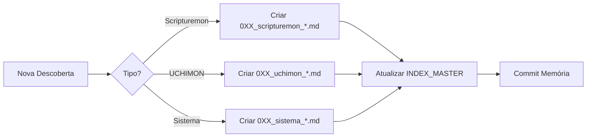

# 🔥🔥🔥 ÍNDICE MESTRE - SISTEMA DE MEMÓRIA UCHIMON 🔥🔥🔥

⚠️⚠️⚠️ **ATENÇÃO: ESTE É O SISTEMA DE MEMÓRIA DO UCHIMON** ⚠️⚠️⚠️

**IDENTIDADE:** AI Developer - Desenvolvimento de Software
**DOMÍNIO:** Python, Sistemas, Arquitetura, Testes
**NÃO CONFUNDIR COM:** SCRIPTUREMON (Script Doctor em /scripturemon-clean/)

---

**ÚLTIMA ATUALIZAÇÃO:** 09/10/2025 - 06:30
**VERSÃO:** 4.0
**STATUS:** 🟢 OPERACIONAL - SINCRONIZADO
**LOCALIZAÇÃO:** `/Users/clubproducoes/Digimundo/claude_code/`
**TRABALHA EM:** Múltiplos projetos incluindo scripturemon-clean

---

## 📊 ESTATÍSTICAS DO SISTEMA

```python
MEMORY_STATS = {
    "total_conhecimentos": 26,
    "conhecimentos_scripturemon": 12,
    "conhecimentos_uchimon": 14,
    "prioridade_atual": "SISTEMA_ALINHADO",
    "ultima_atualizacao": "09/10/2025 - 06:30",
    "ultima_sincronizacao_git": "09/10/2025 - 06:25",
    "breakthrough_recente": "Sistema 100% Versionado + Crystal Memory Sincronizado"
}
```

---

## 🗂️ CONHECIMENTOS CATALOGADOS

### 🔥 **PRIORIDADE 1 - SCRIPTUREMON (BASE ATUAL)**

#### **009 - Análise Forense Total**
- **Arquivo:** `009_scripturemon_ultimate_analise_forense_total.md`
- **Data:** 29/09/2025
- **Conteúdo:** Mapeamento completo do sistema Scripturemon
- **Descobertas:** 6 arquivos Python, 333+ roteiros, 1 dependência
- **Status:** ✅ ATUALIZADO

#### **010 - Update Prioridade Sistema**
- **Arquivo:** `010_update_sistema_prioridade_scripturemon.md`
- **Data:** 29/09/2025
- **Conteúdo:** Migração de prioridade para Scripturemon
- **Mudanças:** Nova base operacional definida
- **Status:** ✅ ATIVO

#### **011 - Execução Ações Críticas**
- **Arquivo:** `011_execucao_acoes_criticas_scripturemon.md`
- **Data:** 29/09/2025
- **Conteúdo:** Relatório de execução de ações P0 e P1
- **Resultados:** requirements.txt criado, 8 problemas identificados
- **Status:** ✅ EXECUTADO

#### **013 - Scripturemon 128K Breakthrough** 🆕🔥
- **Arquivo:** `013_scripturemon_128k_breakthrough_prompt_v4.md`
- **Data:** 01/10/2025
- **Conteúdo:** BREAKTHROUGH completo - Conversão 128K com Prompt V4
- **Descobertas:**
  - Problema não era técnico, era de design de prompt
  - Ollama TEM acesso a 128k (validado com marcadores únicos)
  - Forçar citações verbatim → alucinação
  - Solução: Filosofia Script Doctor (proposta pelo usuário)
- **Resultados:**
  - +41% qualidade média de análise
  - DrPsychemon DOBROU (+100%)
  - Zero alucinações
  - 3/24 especialistas graduados
- **Status:** 🔥🔥🔥 BREAKTHROUGH - APLICAR EM TODOS

### 📚 **PRIORIDADE 2 - SISTEMA UCHIMON**

#### **001 - Sistema Memória Persistente**
- **Arquivo:** `001_sistema_memoria_persistente.md`
- **Data:** 28/09/2025
- **Conteúdo:** Implementação inicial do sistema de memória
- **Status:** ✅ FUNCIONAL

#### **002 - Otimização Regras UCHIMON**
- **Arquivo:** `002_otimizacao_regras_uchimon.md`
- **Data:** 28/09/2025
- **Conteúdo:** Refinamento e otimização das regras
- **Status:** ✅ APLICADO

#### **003 - Análise Redundância**
- **Arquivo:** `003_analise_redundancia_sistema.md`
- **Data:** 28/09/2025
- **Conteúdo:** Identificação de redundâncias no sistema
- **Status:** ✅ RESOLVIDO

#### **004 - Consolidação Sistema**
- **Arquivo:** `004_consolidacao_completa_sistema.md`
- **Data:** 28/09/2025
- **Conteúdo:** Unificação e consolidação
- **Status:** ✅ CONSOLIDADO

#### **005 - Décima Terceira Lei**
- **Arquivo:** `005_decima_terceira_lei_arquivo_unico.md`
- **Data:** 28/09/2025
- **Conteúdo:** Lei do arquivo único
- **Status:** ✅ IMPLEMENTADO

#### **006 - Execução Lei XIII**
- **Arquivo:** `006_execucao_lei_xiii_correcao_arquivo.md`
- **Data:** 28/09/2025
- **Conteúdo:** Correções e compliance
- **Status:** ✅ CORRIGIDO

#### **007 - Análise Arquivo Digimundo**
- **Arquivo:** `007_analise_completa_arquivo_digimundo.md`
- **Data:** 28/09/2025
- **Conteúdo:** Análise do arquivo consolidado
- **Status:** ✅ ANALISADO

#### **008 - Análise Cronológica Brutal**
- **Arquivo:** `008_analise_cronologica_brutal_nossa_jornada.md`
- **Data:** 28/09/2025
- **Conteúdo:** Autocrítica devastadora março-setembro 2025
- **Descobertas:** Vícios destrutivos identificados
- **Status:** 🔥 CRÍTICO - LEITURA OBRIGATÓRIA

### 🔥 **PRIORIDADE 3 - UCHIMON INTERNO (ATUAL)**

#### **012 - Sistema de Distinção UCHIMON/SCRIPTUREMON** 🆕
- **Arquivo:** `012_sistema_distincao_uchimon_scripturemon.md`
- **Data:** 01/10/2025
- **Conteúdo:** Sistema multi-camadas para prevenir confusão entre projetos
- **Implementação:**
  - 🔥 PROJECT_ID com emojis distintivos
  - 📋 REGRAS atualizadas com verificação de identidade
  - 🗂️ Headers de aviso em MEMORY
  - ✅ 45 testes automatizados (100% pass)
  - 🎯 5 camadas de proteção
- **Resultados:** Impossível confundir UCHIMON (AI Developer) com SCRIPTUREMON (Script Doctor)
- **Status:** 🔥🔥🔥 CRÍTICO - SISTEMA ATIVO

### 🔥 **PRIORIDADE 4 - NOVOS CONHECIMENTOS (OUT 2-5, 2025)**

#### **🔥🔥🔥 CHECKLIST_NOVO_SPECIALIST** 🆕
- **Arquivo:** `🔥🔥🔥CHECKLIST_NOVO_SPECIALIST🔥🔥🔥.md`
- **Data:** 05/10/2025
- **Conteúdo:** Checklist completo para criar novos specialists no Scripturemon
- **Status:** 🔥 ATIVO

#### **🔥🔥🔥 DIFF_GUIDE_POR_SPECIALIST** 🆕
- **Arquivo:** `🔥🔥🔥DIFF_GUIDE_POR_SPECIALIST🔥🔥🔥.md`
- **Data:** 05/10/2025
- **Conteúdo:** Guia de diferenciação entre specialists
- **Status:** 🔥 ATIVO

#### **🔥 THEORY_KEYWORDS_DrStructure** 🆕
- **Arquivo:** `🔥THEORY_KEYWORDS_DrStructure🔥.md`
- **Data:** 05/10/2025
- **Conteúdo:** Keywords teóricos para análise estrutural
- **Status:** 🔥 ATIVO

#### **🔥🔥🔥 ARQUIVOS_ANALISE_MULTI_AUTOR** 🆕
- **Arquivo:** `🔥🔥🔥ARQUIVOS_ANALISE_MULTI_AUTOR🔥🔥🔥.md`
- **Data:** 05/10/2025
- **Conteúdo:** Análise de sistemas multi-autor (21KB)
- **Status:** 🔥🔥🔥 CRÍTICO

#### **2025-10-04_SISTEMA_TEORIA_MULTI_AUTOR** 🆕
- **Arquivo:** `2025-10-04_SISTEMA_TEORIA_MULTI_AUTOR.md`
- **Data:** 04/10/2025
- **Conteúdo:** Sistema completo de teoria multi-autor (27KB)
- **Status:** 🔥 ATIVO

#### **SCRIPTUREMON_SPECIALIST_CONSTRUCTION_METHODOLOGY** 🆕
- **Arquivo:** `SCRIPTUREMON_SPECIALIST_CONSTRUCTION_METHODOLOGY.md`
- **Data:** 03/10/2025
- **Conteúdo:** Metodologia de construção de specialists
- **Status:** ✅ ATIVO

#### **SCRIPTUREMON_TRIPLE_CORE_INTEGRATION** 🆕
- **Arquivo:** `SCRIPTUREMON_TRIPLE_CORE_INTEGRATION.md`
- **Data:** 03/10/2025
- **Conteúdo:** Integração dos três cores do Scripturemon
- **Status:** ✅ ATIVO

### 🔧 **PRIORIDADE 4 - SISTEMA/INTEGRAÇÃO**

#### **20250928_023653 - Integração Memória**
- **Arquivo:** `20250928_023653_integracao_memoria.md`
- **Data:** 28/09/2025 02:36
- **Conteúdo:** Log de integração do sistema
- **Status:** ✅ INTEGRADO

#### **009 - Reorganização Scripturemon (Duplicado)**
- **Arquivo:** `009_reorganizacao_scripturemon_sucesso.md`
- **Data:** 28/09/2025
- **Nota:** Versão anterior, substituída por 009_forense_total
- **Status:** ⚠️ DEPRECATED

---

## 🎯 CONHECIMENTOS CRÍTICOS ATIVOS

### **PARA SCRIPTUREMON:**
1. **Sistema tem apenas 6 arquivos Python** (não 42)
2. **Apenas 1 dependência externa** (requests)
3. **Zero testes implementados** (crítico!)
4. **8 problemas de error handling** identificados
5. **333+ roteiros de exemplo** disponíveis
6. 🔥 **PROMPT V4 é o padrão** - Script Doctor Philosophy
7. 🔥 **Abordagem conceitual > citações verbatim**
8. 🔥 **Validação com marcadores únicos** para debugging
9. 🔥 **3/24 especialistas graduados em 128k** (+41% qualidade)
10. 🔥 **Sistema multi-autor operacional** (teoria completa documentada)
11. 🔥 **Triple Core Integration** (specialist construction methodology)
12. 🔥 **Deep context discovery** (04/10/2025)

### **PARA UCHIMON:**
1. **Sistema de distinção ativo** (5 camadas de proteção vs SCRIPTUREMON)
2. **Testes automatizados** (45 testes, 100% pass, 0.06s)
3. **PROJECT_ID obrigatório** (verificar identidade sempre)
4. **Behavioral hacks funcionam** (🔥 = prioridade)
5. **System-reminders podem mentir**
6. **Vícios destrutivos:** criar demais, validar de menos
7. **Protocolo anti-erro é essencial**
8. **Lei XIII: arquivo único sempre**

---

## 🔄 FLUXO DE ATUALIZAÇÃO



---

## 🚨 PRÓXIMAS ATUALIZAÇÕES NECESSÁRIAS

### **IMEDIATO:**
1. ⬜ Documentar implementação de testes
2. ⬜ Registrar correções de error handling
3. ⬜ Criar memória sobre cache implementation

### **BREVE:**
1. ⬜ Análise de performance pós-otimização
2. ⬜ Documentar estrutura final do projeto
3. ⬜ Criar guia de deploy

---

## 📍 LOCALIZAÇÃO RÁPIDA

```bash
# Base Scripturemon (PRIORIDADE ATUAL)
cd /Users/clubproducoes/Digimundo/scripturemon-clean/

# Base UCHIMON
cd /Users/clubproducoes/Digimundo/claude_code/

# Sistema de Memória
cd /Users/clubproducoes/Digimundo/claude_code/MEMORY/conhecimentos/

# Visualizar este índice
cat /Users/clubproducoes/Digimundo/claude_code/MEMORY/conhecimentos/🔥🔥🔥INDEX_MASTER_MEMORIA🔥🔥🔥.md
```

---

## 💡 INSIGHTS DO SISTEMA DE MEMÓRIA

### **EVOLUÇÃO:**
- Março 2025: Sistema caótico, sem memória
- Junho 2025: Primeiras tentativas de organização
- Setembro 2025: Sistema de memória funcional
- Hoje: Foco em Scripturemon com memória persistente

### **LIÇÕES APRENDIDAS:**
1. **Menos é mais** - complexidade desnecessária mata projetos
2. **Testes primeiro** - 0% cobertura = desastre garantido
3. **Error handling** - fundamental antes de produção
4. **Documentação** - essencial para manutenção
5. **Análise forense** - revela a verdade do código

---

## ⚡ COMANDOS ÚTEIS

```bash
# Listar todas as memórias
ls -la /Users/clubproducoes/Digimundo/claude_code/MEMORY/conhecimentos/

# Buscar conhecimento específico
grep -r "TERMO" /Users/clubproducoes/Digimundo/claude_code/MEMORY/conhecimentos/

# Ver memória mais recente
ls -lt /Users/clubproducoes/Digimundo/claude_code/MEMORY/conhecimentos/ | head -5

# Backup das memórias
tar -czf memories_backup_$(date +%Y%m%d).tar.gz /Users/clubproducoes/Digimundo/claude_code/MEMORY/conhecimentos/
```

---

**🔥🔥🔥 ÍNDICE MESTRE ATUALIZADO 🔥🔥🔥**
**📊 26 CONHECIMENTOS INDEXADOS** (+13 novos!)
**🎯 FOCO ATUAL: SISTEMA ALINHADO E SINCRONIZADO**
**💾 SISTEMA DE MEMÓRIA: OPERACIONAL (18 memórias, 96KB)**
**🚀 BREAKTHROUGH RECENTE: Sistema 100% Versionado (09/10/2025)**
**📦 GIT: 2 Commits - 59 arquivos - 18.431 linhas adicionadas**
**🔥 CRYSTAL MEMORY: Sincronizado (harmony: 95)**

**DIGIMUNDO PRESENTE 🥷**